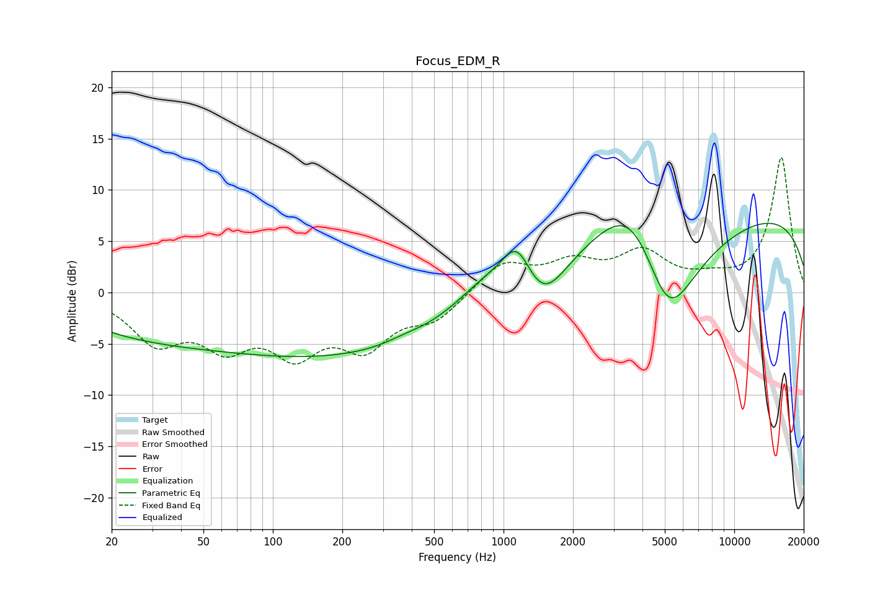

# Focus_EDM_R
See [usage instructions](https://github.com/jaakkopasanen/AutoEq#usage) for more options and info.

### Parametric EQs
Apply preamp of -6.8 dB when using parametric equalizer.

|   # | Type    |   Fc (Hz) |    Q |   Gain (dB) |
|-----|---------|-----------|------|-------------|
|   1 | Peaking |        20 | 1.47 |        -0.3 |
|   2 | Peaking |        27 | 0.5  |        -2.7 |
|   3 | Peaking |       193 | 0.22 |        -6.2 |
|   4 | Peaking |       372 | 1.56 |         0.4 |
|   5 | Peaking |       847 | 0.89 |         3.2 |
|   6 | Peaking |      1144 | 2.28 |         3.9 |
|   7 | Peaking |      1482 | 1.51 |        -4   |
|   8 | Peaking |      3673 | 0.85 |         8.7 |
|   9 | Peaking |      5136 | 0.91 |       -13.9 |
|  10 | Peaking |      9435 | 0.18 |         8.4 |

### Fixed Band EQs
When using fixed band (also called graphic) equalizer, apply preamp of **-13.2 dB** (if available) and set gains manually with these parameters.

|   # | Type    |   Fc (Hz) |    Q |   Gain (dB) |
|-----|---------|-----------|------|-------------|
|   1 | Peaking |        31 | 1.41 |        -4.4 |
|   2 | Peaking |        62 | 1.41 |        -4.4 |
|   3 | Peaking |       125 | 1.41 |        -5.1 |
|   4 | Peaking |       250 | 1.41 |        -4.7 |
|   5 | Peaking |       500 | 1.41 |        -2.4 |
|   6 | Peaking |      1000 | 1.41 |         2.9 |
|   7 | Peaking |      2000 | 1.41 |         2.5 |
|   8 | Peaking |      4000 | 1.41 |         3.6 |
|   9 | Peaking |      8000 | 1.41 |         0.9 |
|  10 | Peaking |     16000 | 1.41 |        13.2 |

### Graphs

