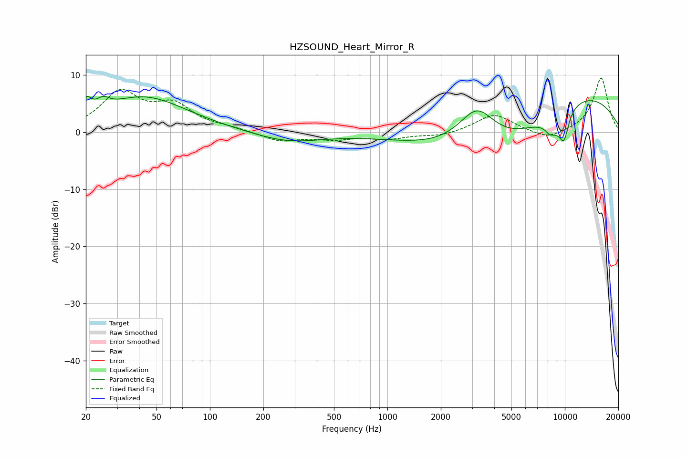

# HZSOUND_Heart_Mirror_R
See [usage instructions](https://github.com/jaakkopasanen/AutoEq#usage) for more options and info.

### Parametric EQs
Apply preamp of -6.4 dB when using parametric equalizer.

|   # | Type    |   Fc (Hz) |    Q |   Gain (dB) |
|-----|---------|-----------|------|-------------|
|   1 | Peaking |        20 | 5.08 |         2.6 |
|   2 | Peaking |        25 | 4.03 |         1.5 |
|   3 | Peaking |        42 | 0.58 |         6.1 |
|   4 | Peaking |       275 | 0.76 |        -1.8 |
|   5 | Peaking |      3196 | 1.28 |         7.6 |
|   6 | Peaking |      4534 | 0.39 |        -9.4 |
|   7 | Peaking |      8184 | 5.86 |        -0.8 |
|   8 | Peaking |      8833 | 2.16 |        -2.9 |
|   9 | Peaking |      9686 | 0.32 |        10   |
|  10 | Peaking |      9897 | 4.64 |        -4.3 |

### Fixed Band EQs
When using fixed band (also called graphic) equalizer, apply preamp of **-9.5 dB** (if available) and set gains manually with these parameters.

|   # | Type    |   Fc (Hz) |    Q |   Gain (dB) |
|-----|---------|-----------|------|-------------|
|   1 | Peaking |        31 | 1.41 |         6.7 |
|   2 | Peaking |        62 | 1.41 |         4.2 |
|   3 | Peaking |       125 | 1.41 |         0.5 |
|   4 | Peaking |       250 | 1.41 |        -1.6 |
|   5 | Peaking |       500 | 1.41 |        -1   |
|   6 | Peaking |      1000 | 1.41 |        -1.1 |
|   7 | Peaking |      2000 | 1.41 |        -0.7 |
|   8 | Peaking |      4000 | 1.41 |         3.2 |
|   9 | Peaking |      8000 | 1.41 |        -1.5 |
|  10 | Peaking |     16000 | 1.41 |         9.5 |

### Graphs

