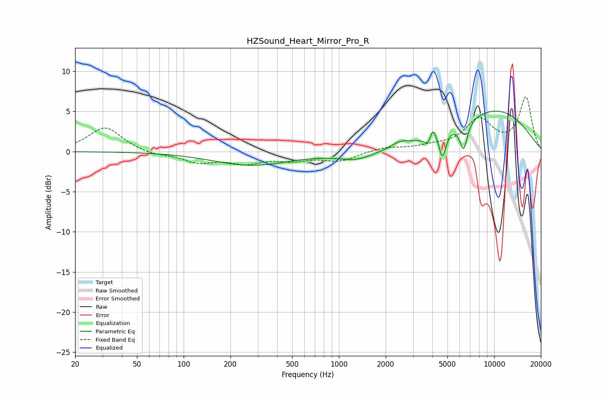

# HZSound_Heart_Mirror_Pro_R
See [usage instructions](https://github.com/jaakkopasanen/AutoEq#usage) for more options and info.

### Parametric EQs
Apply preamp of -5.1 dB when using parametric equalizer.

|   # | Type    |   Fc (Hz) |    Q |   Gain (dB) |
|-----|---------|-----------|------|-------------|
|   1 | Peaking |       273 | 0.57 |        -1.7 |
|   2 | Peaking |      1299 | 1.2  |        -1.1 |
|   3 | Peaking |      2481 | 2.73 |         0.6 |
|   4 | Peaking |      3783 | 5.96 |        -1.7 |
|   5 | Peaking |      3929 | 6    |         0.4 |
|   6 | Peaking |      4022 | 5.95 |         1.7 |
|   7 | Peaking |      4649 | 5.87 |        -3.4 |
|   8 | Peaking |      5162 | 6    |         0.2 |
|   9 | Peaking |      6358 | 5.56 |        -3.4 |
|  10 | Peaking |     10000 | 0.44 |         5.1 |

### Fixed Band EQs
When using fixed band (also called graphic) equalizer, apply preamp of **-6.9 dB** (if available) and set gains manually with these parameters.

|   # | Type    |   Fc (Hz) |    Q |   Gain (dB) |
|-----|---------|-----------|------|-------------|
|   1 | Peaking |        31 | 1.41 |         3.1 |
|   2 | Peaking |        62 | 1.41 |        -0.4 |
|   3 | Peaking |       125 | 1.41 |        -1.2 |
|   4 | Peaking |       250 | 1.41 |        -1.3 |
|   5 | Peaking |       500 | 1.41 |        -0.9 |
|   6 | Peaking |      1000 | 1.41 |        -1.1 |
|   7 | Peaking |      2000 | 1.41 |         0.5 |
|   8 | Peaking |      4000 | 1.41 |         0.5 |
|   9 | Peaking |      8000 | 1.41 |         3.8 |
|  10 | Peaking |     16000 | 1.41 |         6.6 |

### Graphs

