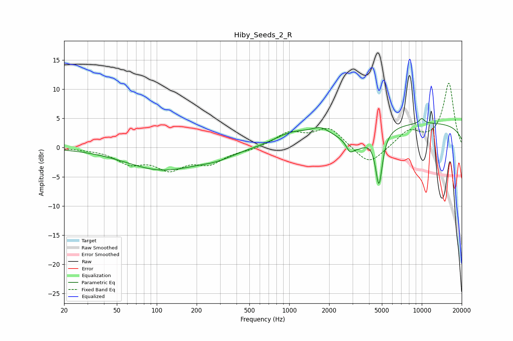

# Hiby_Seeds_2_R
See [usage instructions](https://github.com/jaakkopasanen/AutoEq#usage) for more options and info.

### Parametric EQs
Apply preamp of -5.1 dB when using parametric equalizer.

|   # | Type    |   Fc (Hz) |    Q |   Gain (dB) |
|-----|---------|-----------|------|-------------|
|   1 | Peaking |       109 | 0.52 |        -3.7 |
|   2 | Peaking |       283 | 1.03 |        -1   |
|   3 | Peaking |      1059 | 1    |         2   |
|   4 | Peaking |      1723 | 2.07 |         1.4 |
|   5 | Peaking |      2863 | 5.86 |        -1.3 |
|   6 | Peaking |      3247 | 1.7  |        -2.9 |
|   7 | Peaking |      4750 | 5.33 |        -9.1 |
|   8 | Peaking |     10000 | 5.99 |         0.1 |
|   9 | Peaking |     10000 | 5.99 |         0.8 |
|  10 | Peaking |     10000 | 0.18 |         4.2 |

### Fixed Band EQs
When using fixed band (also called graphic) equalizer, apply preamp of **-11.1 dB** (if available) and set gains manually with these parameters.

|   # | Type    |   Fc (Hz) |    Q |   Gain (dB) |
|-----|---------|-----------|------|-------------|
|   1 | Peaking |        31 | 1.41 |        -0.1 |
|   2 | Peaking |        62 | 1.41 |        -2.4 |
|   3 | Peaking |       125 | 1.41 |        -3.3 |
|   4 | Peaking |       250 | 1.41 |        -2.4 |
|   5 | Peaking |       500 | 1.41 |        -0.4 |
|   6 | Peaking |      1000 | 1.41 |         2.4 |
|   7 | Peaking |      2000 | 1.41 |         3.3 |
|   8 | Peaking |      4000 | 1.41 |        -3.3 |
|   9 | Peaking |      8000 | 1.41 |         2.7 |
|  10 | Peaking |     16000 | 1.41 |        11   |

### Graphs

