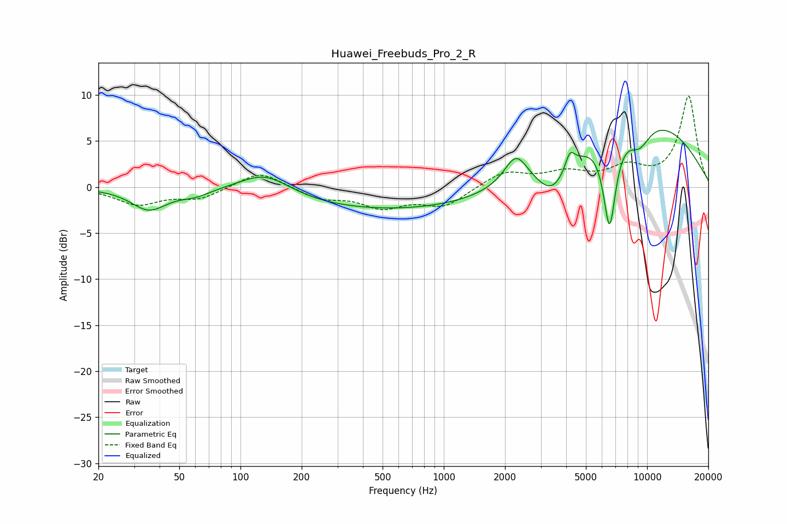

# Huawei_Freebuds_Pro_2_R
See [usage instructions](https://github.com/jaakkopasanen/AutoEq#usage) for more options and info.

### Parametric EQs
Apply preamp of -6.3 dB when using parametric equalizer.

|   # | Type    |   Fc (Hz) |    Q |   Gain (dB) |
|-----|---------|-----------|------|-------------|
|   1 | Peaking |        35 | 1.62 |        -2.4 |
|   2 | Peaking |        60 | 1.88 |        -0.7 |
|   3 | Peaking |       132 | 1.11 |         2.4 |
|   4 | Peaking |       722 | 0.21 |        -2.7 |
|   5 | Peaking |      2266 | 2.49 |         3.3 |
|   6 | Peaking |      3446 | 1.66 |        -3.9 |
|   7 | Peaking |      4170 | 6    |         1.9 |
|   8 | Peaking |      6538 | 4.22 |       -10.3 |
|   9 | Peaking |      8383 | 0.32 |         8.2 |
|  10 | Peaking |      9153 | 2.21 |        -2.7 |

### Fixed Band EQs
When using fixed band (also called graphic) equalizer, apply preamp of **-10.0 dB** (if available) and set gains manually with these parameters.

|   # | Type    |   Fc (Hz) |    Q |   Gain (dB) |
|-----|---------|-----------|------|-------------|
|   1 | Peaking |        31 | 1.41 |        -1.8 |
|   2 | Peaking |        62 | 1.41 |        -1.2 |
|   3 | Peaking |       125 | 1.41 |         1.8 |
|   4 | Peaking |       250 | 1.41 |        -1.2 |
|   5 | Peaking |       500 | 1.41 |        -2   |
|   6 | Peaking |      1000 | 1.41 |        -2   |
|   7 | Peaking |      2000 | 1.41 |         1.7 |
|   8 | Peaking |      4000 | 1.41 |         1.4 |
|   9 | Peaking |      8000 | 1.41 |         1.9 |
|  10 | Peaking |     16000 | 1.41 |         9.8 |

### Graphs

