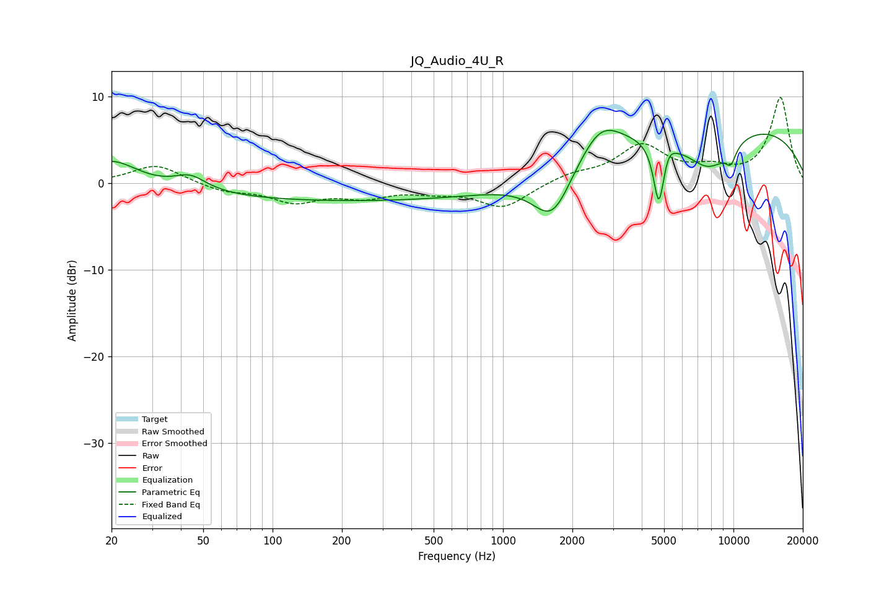

# JQ_Audio_4U_R
See [usage instructions](https://github.com/jaakkopasanen/AutoEq#usage) for more options and info.

### Parametric EQs
Apply preamp of -6.2 dB when using parametric equalizer.

|   # | Type    |   Fc (Hz) |    Q |   Gain (dB) |
|-----|---------|-----------|------|-------------|
|   1 | Peaking |        20 | 1.26 |         2.8 |
|   2 | Peaking |        44 | 2.1  |         1.6 |
|   3 | Peaking |       223 | 0.18 |        -2   |
|   4 | Peaking |      1641 | 1.66 |        -5.8 |
|   5 | Peaking |      2638 | 1.49 |         4   |
|   6 | Peaking |      4745 | 6    |        -7.3 |
|   7 | Peaking |      5226 | 6    |         1   |
|   8 | Peaking |      7806 | 1.21 |        -5   |
|   9 | Peaking |      9150 | 0.23 |         7.2 |
|  10 | Peaking |      9742 | 5.43 |        -1.8 |

### Fixed Band EQs
When using fixed band (also called graphic) equalizer, apply preamp of **-10.0 dB** (if available) and set gains manually with these parameters.

|   # | Type    |   Fc (Hz) |    Q |   Gain (dB) |
|-----|---------|-----------|------|-------------|
|   1 | Peaking |        31 | 1.41 |         2.2 |
|   2 | Peaking |        62 | 1.41 |        -0.9 |
|   3 | Peaking |       125 | 1.41 |        -2   |
|   4 | Peaking |       250 | 1.41 |        -1.4 |
|   5 | Peaking |       500 | 1.41 |        -0.7 |
|   6 | Peaking |      1000 | 1.41 |        -2.8 |
|   7 | Peaking |      2000 | 1.41 |         1   |
|   8 | Peaking |      4000 | 1.41 |         4.2 |
|   9 | Peaking |      8000 | 1.41 |         1.3 |
|  10 | Peaking |     16000 | 1.41 |         9.9 |

### Graphs

