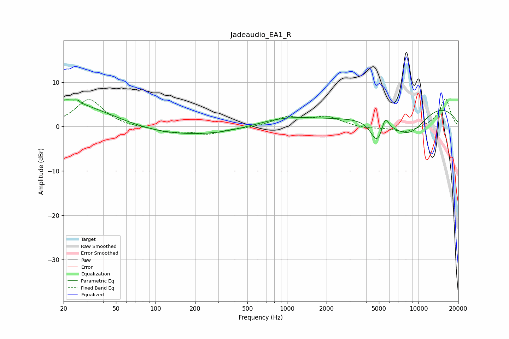

# Jadeaudio_EA1_R
See [usage instructions](https://github.com/jaakkopasanen/AutoEq#usage) for more options and info.

### Parametric EQs
Apply preamp of -6.1 dB when using parametric equalizer.

|   # | Type    |   Fc (Hz) |    Q |   Gain (dB) |
|-----|---------|-----------|------|-------------|
|   1 | Peaking |        20 | 2.1  |         1.4 |
|   2 | Peaking |        26 | 0.45 |         5.2 |
|   3 | Peaking |        26 | 5.47 |         3.4 |
|   4 | Peaking |        27 | 5.94 |        -2.8 |
|   5 | Peaking |       183 | 0.22 |        -2.5 |
|   6 | Peaking |       909 | 0.53 |         2.7 |
|   7 | Peaking |      4834 | 2.87 |        -4.9 |
|   8 | Peaking |      5588 | 5.34 |         3.3 |
|   9 | Peaking |      8512 | 0.72 |        -9.5 |
|  10 | Peaking |     10000 | 0.34 |         8.6 |

### Fixed Band EQs
When using fixed band (also called graphic) equalizer, apply preamp of **-6.3 dB** (if available) and set gains manually with these parameters.

|   # | Type    |   Fc (Hz) |    Q |   Gain (dB) |
|-----|---------|-----------|------|-------------|
|   1 | Peaking |        31 | 1.41 |         6.2 |
|   2 | Peaking |        62 | 1.41 |        -0.2 |
|   3 | Peaking |       125 | 1.41 |        -1.2 |
|   4 | Peaking |       250 | 1.41 |        -1.6 |
|   5 | Peaking |       500 | 1.41 |        -0.3 |
|   6 | Peaking |      1000 | 1.41 |         2   |
|   7 | Peaking |      2000 | 1.41 |         2.1 |
|   8 | Peaking |      4000 | 1.41 |        -0.5 |
|   9 | Peaking |      8000 | 1.41 |        -1.4 |
|  10 | Peaking |     16000 | 1.41 |         6.3 |

### Graphs

