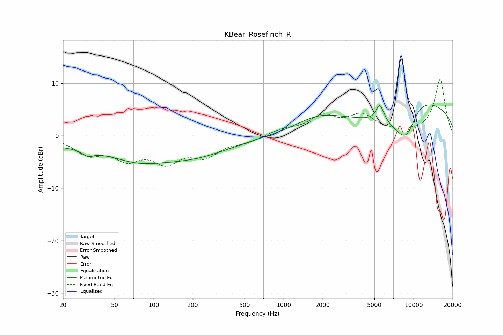

# KBear_Rosefinch_R
See [usage instructions](https://github.com/jaakkopasanen/AutoEq#usage) for more options and info.

### Parametric EQs
Apply preamp of -6.0 dB when using parametric equalizer.

|   # | Type    |   Fc (Hz) |    Q |   Gain (dB) |
|-----|---------|-----------|------|-------------|
|   1 | Peaking |        20 | 0.25 |        -1.6 |
|   2 | Peaking |        31 | 3.4  |        -1.1 |
|   3 | Peaking |        42 | 2.01 |        -0.1 |
|   4 | Peaking |        74 | 0.72 |        -2.4 |
|   5 | Peaking |       194 | 0.47 |        -3.7 |
|   6 | Peaking |      1858 | 0.8  |         2.5 |
|   7 | Peaking |      5396 | 6    |         1.2 |
|   8 | Peaking |      5589 | 4.28 |         2.3 |
|   9 | Peaking |      8871 | 0.74 |       -18.1 |
|  10 | Peaking |     10000 | 0.44 |        19   |

### Fixed Band EQs
When using fixed band (also called graphic) equalizer, apply preamp of **-10.8 dB** (if available) and set gains manually with these parameters.

|   # | Type    |   Fc (Hz) |    Q |   Gain (dB) |
|-----|---------|-----------|------|-------------|
|   1 | Peaking |        31 | 1.41 |        -3.2 |
|   2 | Peaking |        62 | 1.41 |        -3.7 |
|   3 | Peaking |       125 | 1.41 |        -4.4 |
|   4 | Peaking |       250 | 1.41 |        -3.4 |
|   5 | Peaking |       500 | 1.41 |        -1.1 |
|   6 | Peaking |      1000 | 1.41 |         1.1 |
|   7 | Peaking |      2000 | 1.41 |         3.4 |
|   8 | Peaking |      4000 | 1.41 |         3.5 |
|   9 | Peaking |      8000 | 1.41 |         0.4 |
|  10 | Peaking |     16000 | 1.41 |        10.8 |

### Graphs

