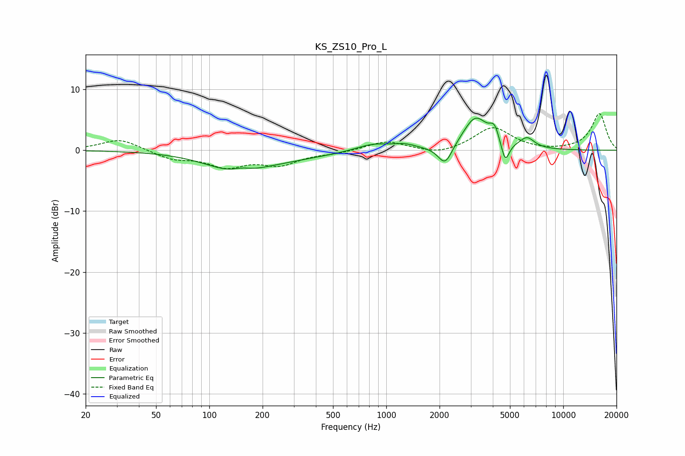

# KS_ZS10_Pro_L
See [usage instructions](https://github.com/jaakkopasanen/AutoEq#usage) for more options and info.

### Parametric EQs
Apply preamp of -5.4 dB when using parametric equalizer.

|   # | Type    |   Fc (Hz) |    Q |   Gain (dB) |
|-----|---------|-----------|------|-------------|
|   1 | Peaking |       142 | 0.84 |        -3.1 |
|   2 | Peaking |       153 | 2.88 |         0.6 |
|   3 | Peaking |       297 | 0.6  |        -0.9 |
|   4 | Peaking |       839 | 1.42 |         1.2 |
|   5 | Peaking |      1269 | 2.16 |         0.7 |
|   6 | Peaking |      2153 | 3.48 |        -3.4 |
|   7 | Peaking |      3193 | 1.99 |         5.4 |
|   8 | Peaking |      4086 | 5.33 |         2.4 |
|   9 | Peaking |      4700 | 6    |        -3.6 |
|  10 | Peaking |      6247 | 3.31 |         1.7 |

### Fixed Band EQs
When using fixed band (also called graphic) equalizer, apply preamp of **-6.1 dB** (if available) and set gains manually with these parameters.

|   # | Type    |   Fc (Hz) |    Q |   Gain (dB) |
|-----|---------|-----------|------|-------------|
|   1 | Peaking |        31 | 1.41 |         1.9 |
|   2 | Peaking |        62 | 1.41 |        -1.3 |
|   3 | Peaking |       125 | 1.41 |        -2.4 |
|   4 | Peaking |       250 | 1.41 |        -2.1 |
|   5 | Peaking |       500 | 1.41 |        -0.4 |
|   6 | Peaking |      1000 | 1.41 |         1.5 |
|   7 | Peaking |      2000 | 1.41 |        -0.8 |
|   8 | Peaking |      4000 | 1.41 |         3.8 |
|   9 | Peaking |      8000 | 1.41 |        -0.2 |
|  10 | Peaking |     16000 | 1.41 |         6   |

### Graphs

