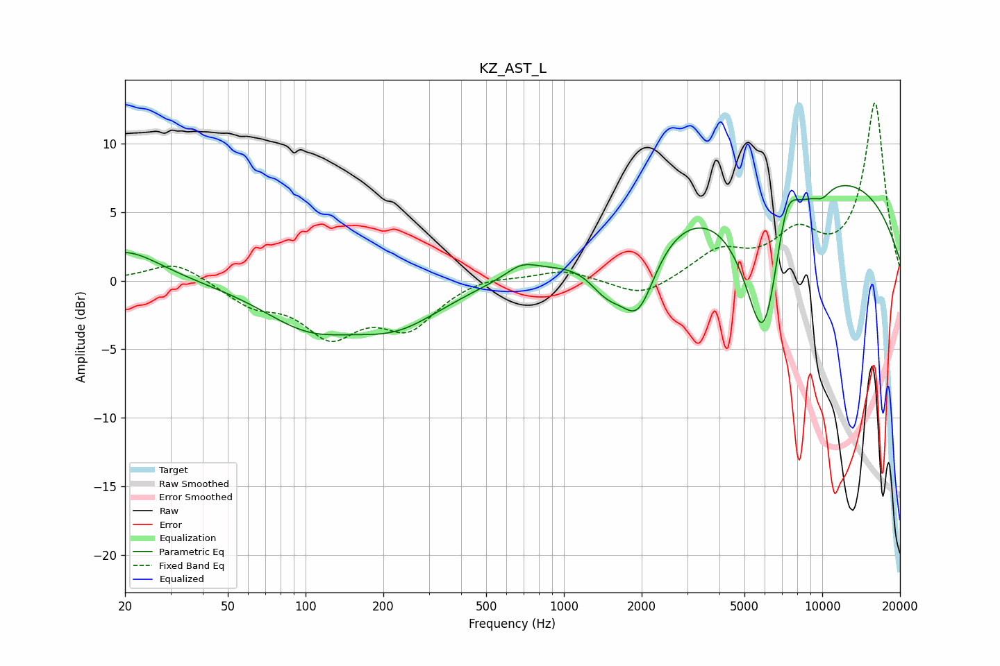

# KZ_AST_L
See [usage instructions](https://github.com/jaakkopasanen/AutoEq#usage) for more options and info.

### Parametric EQs
Apply preamp of -7.0 dB when using parametric equalizer.

|   # | Type    |   Fc (Hz) |    Q |   Gain (dB) |
|-----|---------|-----------|------|-------------|
|   1 | Peaking |        20 | 1.01 |         2.3 |
|   2 | Peaking |       102 | 0.79 |        -2.9 |
|   3 | Peaking |       225 | 0.78 |        -2.9 |
|   4 | Peaking |       685 | 2.29 |         0.9 |
|   5 | Peaking |      1463 | 1.97 |        -2.4 |
|   6 | Peaking |      1939 | 1.99 |        -5.4 |
|   7 | Peaking |      5918 | 1.7  |       -12.6 |
|   8 | Peaking |      7265 | 3.04 |         3.9 |
|   9 | Peaking |      7611 | 0.2  |         8.7 |
|  10 | Peaking |     10000 | 3.76 |        -0.7 |

### Fixed Band EQs
When using fixed band (also called graphic) equalizer, apply preamp of **-13.1 dB** (if available) and set gains manually with these parameters.

|   # | Type    |   Fc (Hz) |    Q |   Gain (dB) |
|-----|---------|-----------|------|-------------|
|   1 | Peaking |        31 | 1.41 |         1.5 |
|   2 | Peaking |        62 | 1.41 |        -1.6 |
|   3 | Peaking |       125 | 1.41 |        -3.6 |
|   4 | Peaking |       250 | 1.41 |        -3.1 |
|   5 | Peaking |       500 | 1.41 |         0.4 |
|   6 | Peaking |      1000 | 1.41 |         0.8 |
|   7 | Peaking |      2000 | 1.41 |        -1.3 |
|   8 | Peaking |      4000 | 1.41 |         2   |
|   9 | Peaking |      8000 | 1.41 |         3   |
|  10 | Peaking |     16000 | 1.41 |        12.9 |

### Graphs

