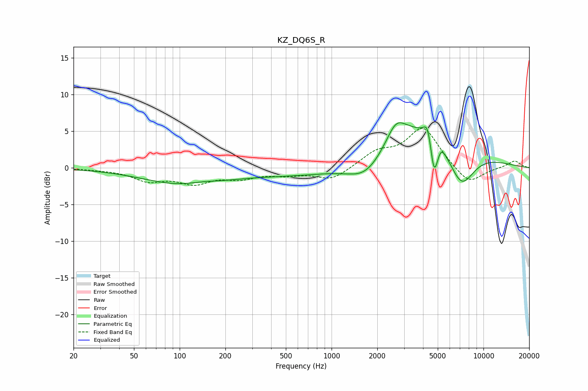

# KZ_DQ6S_R
See [usage instructions](https://github.com/jaakkopasanen/AutoEq#usage) for more options and info.

### Parametric EQs
Apply preamp of -6.2 dB when using parametric equalizer.

|   # | Type    |   Fc (Hz) |    Q |   Gain (dB) |
|-----|---------|-----------|------|-------------|
|   1 | Peaking |       110 | 0.52 |        -2.3 |
|   2 | Peaking |       141 | 1.37 |         0.4 |
|   3 | Peaking |      1021 | 0.32 |        -1.4 |
|   4 | Peaking |      1696 | 1.14 |        -3.3 |
|   5 | Peaking |      2655 | 2.3  |         2.7 |
|   6 | Peaking |      3878 | 0.45 |         7   |
|   7 | Peaking |      4293 | 5.57 |         2.5 |
|   8 | Peaking |      4729 | 5.47 |        -5.3 |
|   9 | Peaking |      5263 | 6    |         0.9 |
|  10 | Peaking |      7125 | 1.48 |        -6.2 |

### Fixed Band EQs
When using fixed band (also called graphic) equalizer, apply preamp of **-5.5 dB** (if available) and set gains manually with these parameters.

|   # | Type    |   Fc (Hz) |    Q |   Gain (dB) |
|-----|---------|-----------|------|-------------|
|   1 | Peaking |        31 | 1.41 |        -0.1 |
|   2 | Peaking |        62 | 1.41 |        -1.6 |
|   3 | Peaking |       125 | 1.41 |        -1.9 |
|   4 | Peaking |       250 | 1.41 |        -1.2 |
|   5 | Peaking |       500 | 1.41 |        -0.7 |
|   6 | Peaking |      1000 | 1.41 |        -1.7 |
|   7 | Peaking |      2000 | 1.41 |         2   |
|   8 | Peaking |      4000 | 1.41 |         5.4 |
|   9 | Peaking |      8000 | 1.41 |        -2.4 |
|  10 | Peaking |     16000 | 1.41 |         1   |

### Graphs

