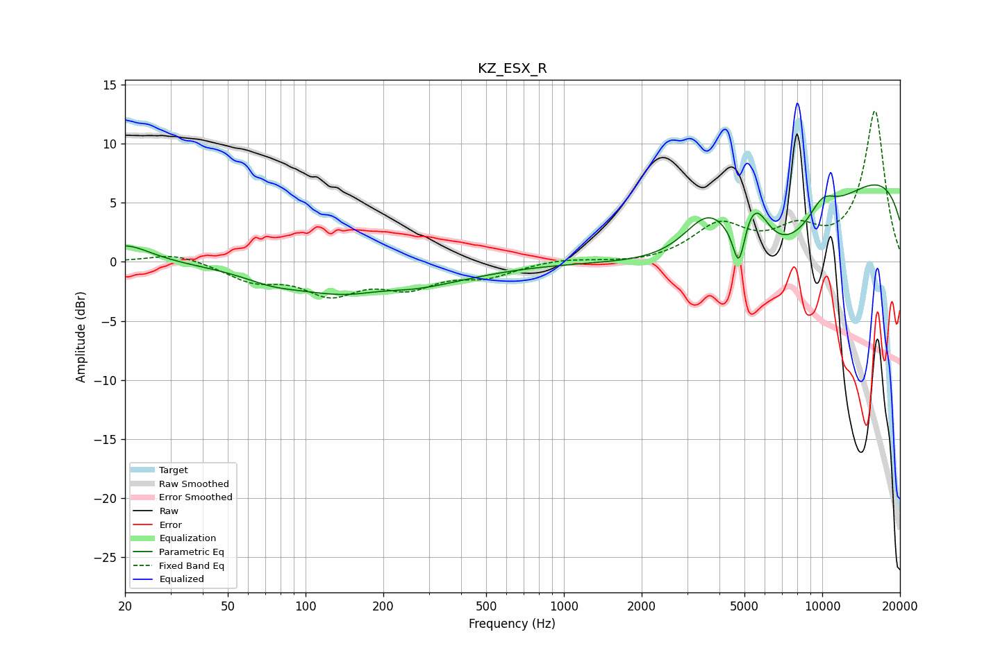

# KZ_ESX_R
See [usage instructions](https://github.com/jaakkopasanen/AutoEq#usage) for more options and info.

### Parametric EQs
Apply preamp of -6.6 dB when using parametric equalizer.

|   # | Type    |   Fc (Hz) |    Q |   Gain (dB) |
|-----|---------|-----------|------|-------------|
|   1 | Peaking |        20 | 1.45 |         1.5 |
|   2 | Peaking |        73 | 1.44 |        -0.6 |
|   3 | Peaking |       175 | 0.51 |        -3.3 |
|   4 | Peaking |       194 | 1.23 |         0.8 |
|   5 | Peaking |      3644 | 1.39 |         5   |
|   6 | Peaking |      4757 | 6    |        -3.8 |
|   7 | Peaking |      5470 | 2.32 |         4.7 |
|   8 | Peaking |      5550 | 0.34 |       -14.4 |
|   9 | Peaking |      8960 | 0.18 |        13.5 |
|  10 | Peaking |     10000 | 2.2  |         2   |

### Fixed Band EQs
When using fixed band (also called graphic) equalizer, apply preamp of **-12.9 dB** (if available) and set gains manually with these parameters.

|   # | Type    |   Fc (Hz) |    Q |   Gain (dB) |
|-----|---------|-----------|------|-------------|
|   1 | Peaking |        31 | 1.41 |         0.8 |
|   2 | Peaking |        62 | 1.41 |        -1.4 |
|   3 | Peaking |       125 | 1.41 |        -2.4 |
|   4 | Peaking |       250 | 1.41 |        -1.9 |
|   5 | Peaking |       500 | 1.41 |        -1.1 |
|   6 | Peaking |      1000 | 1.41 |         0.3 |
|   7 | Peaking |      2000 | 1.41 |        -0.2 |
|   8 | Peaking |      4000 | 1.41 |         3   |
|   9 | Peaking |      8000 | 1.41 |         2.2 |
|  10 | Peaking |     16000 | 1.41 |        12.7 |

### Graphs

