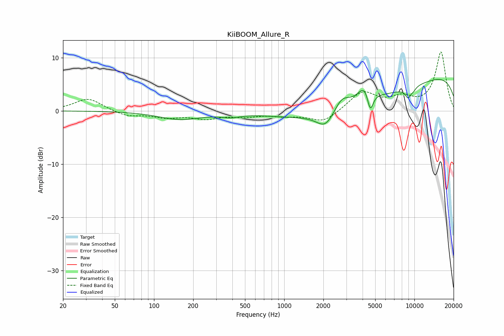

# KiiBOOM_Allure_R
See [usage instructions](https://github.com/jaakkopasanen/AutoEq#usage) for more options and info.

### Parametric EQs
Apply preamp of -6.0 dB when using parametric equalizer.

|   # | Type    |   Fc (Hz) |    Q |   Gain (dB) |
|-----|---------|-----------|------|-------------|
|   1 | Peaking |       159 | 0.85 |        -1.5 |
|   2 | Peaking |       388 | 2.07 |        -0.6 |
|   3 | Peaking |      2072 | 2.11 |        -2.9 |
|   4 | Peaking |      2770 | 2.49 |         2.3 |
|   5 | Peaking |      4170 | 2.79 |         3.2 |
|   6 | Peaking |      4189 | 0.25 |        -5   |
|   7 | Peaking |      4578 | 5.96 |        -4   |
|   8 | Peaking |      8949 | 5.74 |        -1.8 |
|   9 | Peaking |      9833 | 5.93 |        -0.6 |
|  10 | Peaking |     10000 | 0.18 |         8.3 |

### Fixed Band EQs
When using fixed band (also called graphic) equalizer, apply preamp of **-11.1 dB** (if available) and set gains manually with these parameters.

|   # | Type    |   Fc (Hz) |    Q |   Gain (dB) |
|-----|---------|-----------|------|-------------|
|   1 | Peaking |        31 | 1.41 |         2.4 |
|   2 | Peaking |        62 | 1.41 |        -1   |
|   3 | Peaking |       125 | 1.41 |        -1.1 |
|   4 | Peaking |       250 | 1.41 |        -1.3 |
|   5 | Peaking |       500 | 1.41 |        -0.8 |
|   6 | Peaking |      1000 | 1.41 |        -0.7 |
|   7 | Peaking |      2000 | 1.41 |        -2.2 |
|   8 | Peaking |      4000 | 1.41 |         3.5 |
|   9 | Peaking |      8000 | 1.41 |         2.1 |
|  10 | Peaking |     16000 | 1.41 |        11   |

### Graphs

