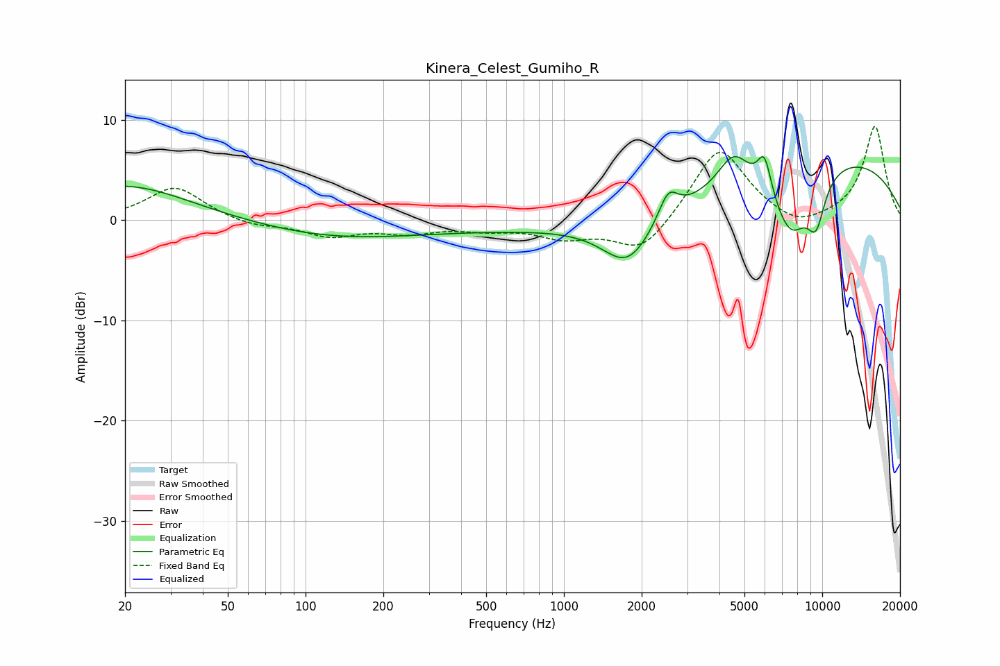

# Kinera_Celest_Gumiho_R
See [usage instructions](https://github.com/jaakkopasanen/AutoEq#usage) for more options and info.

### Parametric EQs
Apply preamp of -6.4 dB when using parametric equalizer.

|   # | Type    |   Fc (Hz) |    Q |   Gain (dB) |
|-----|---------|-----------|------|-------------|
|   1 | Peaking |        20 | 0.58 |         3.5 |
|   2 | Peaking |       129 | 0.46 |        -1.6 |
|   3 | Peaking |      1318 | 0.18 |        -1   |
|   4 | Peaking |      1763 | 1.46 |        -4.6 |
|   5 | Peaking |      2534 | 3.7  |         2.8 |
|   6 | Peaking |      4544 | 2.29 |         3.5 |
|   7 | Peaking |      5974 | 5.15 |         3.7 |
|   8 | Peaking |      7536 | 1.72 |        -6.8 |
|   9 | Peaking |      9467 | 3.53 |        -4.4 |
|  10 | Peaking |     10000 | 0.27 |         6.7 |

### Fixed Band EQs
When using fixed band (also called graphic) equalizer, apply preamp of **-9.4 dB** (if available) and set gains manually with these parameters.

|   # | Type    |   Fc (Hz) |    Q |   Gain (dB) |
|-----|---------|-----------|------|-------------|
|   1 | Peaking |        31 | 1.41 |         3.3 |
|   2 | Peaking |        62 | 1.41 |        -0.6 |
|   3 | Peaking |       125 | 1.41 |        -1.5 |
|   4 | Peaking |       250 | 1.41 |        -1.1 |
|   5 | Peaking |       500 | 1.41 |        -0.7 |
|   6 | Peaking |      1000 | 1.41 |        -1.6 |
|   7 | Peaking |      2000 | 1.41 |        -3.4 |
|   8 | Peaking |      4000 | 1.41 |         7.5 |
|   9 | Peaking |      8000 | 1.41 |        -1.2 |
|  10 | Peaking |     16000 | 1.41 |         9.4 |

### Graphs

