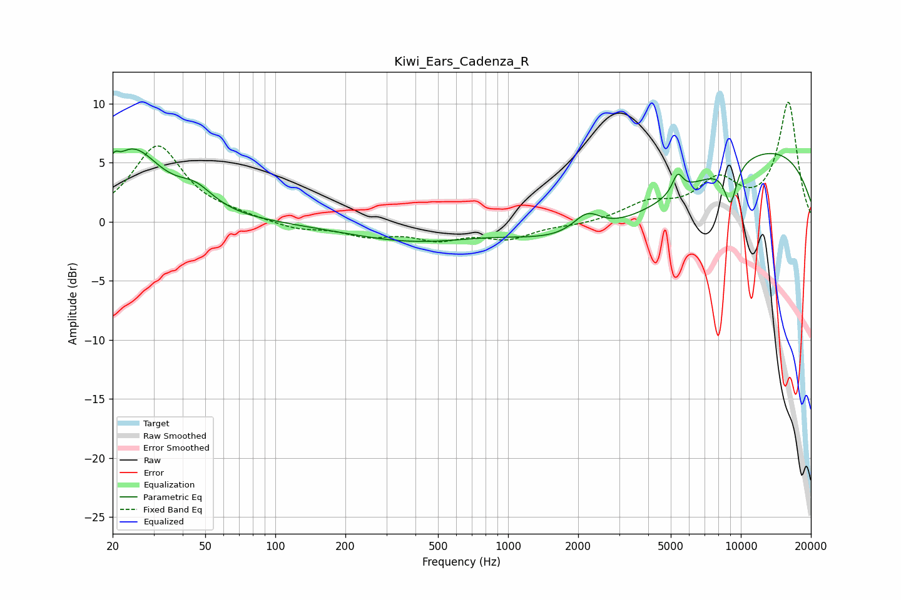

# Kiwi_Ears_Cadenza_R
See [usage instructions](https://github.com/jaakkopasanen/AutoEq#usage) for more options and info.

### Parametric EQs
Apply preamp of -6.2 dB when using parametric equalizer.

|   # | Type    |   Fc (Hz) |    Q |   Gain (dB) |
|-----|---------|-----------|------|-------------|
|   1 | Peaking |        21 | 5.84 |         2.6 |
|   2 | Peaking |        21 | 5.84 |        -1.9 |
|   3 | Peaking |        24 | 1.15 |         5.8 |
|   4 | Peaking |        45 | 1.81 |         1.7 |
|   5 | Peaking |       880 | 0.5  |         3   |
|   6 | Peaking |      1645 | 0.18 |        -5.4 |
|   7 | Peaking |      2185 | 2.34 |         1.8 |
|   8 | Peaking |      5353 | 6    |         1.6 |
|   9 | Peaking |      9033 | 4.73 |        -3.3 |
|  10 | Peaking |     10000 | 0.24 |         7.2 |

### Fixed Band EQs
When using fixed band (also called graphic) equalizer, apply preamp of **-10.2 dB** (if available) and set gains manually with these parameters.

|   # | Type    |   Fc (Hz) |    Q |   Gain (dB) |
|-----|---------|-----------|------|-------------|
|   1 | Peaking |        31 | 1.41 |         6.4 |
|   2 | Peaking |        62 | 1.41 |         0.4 |
|   3 | Peaking |       125 | 1.41 |        -0.6 |
|   4 | Peaking |       250 | 1.41 |        -1.1 |
|   5 | Peaking |       500 | 1.41 |        -1.3 |
|   6 | Peaking |      1000 | 1.41 |        -1.3 |
|   7 | Peaking |      2000 | 1.41 |        -0.3 |
|   8 | Peaking |      4000 | 1.41 |         1.4 |
|   9 | Peaking |      8000 | 1.41 |         3.2 |
|  10 | Peaking |     16000 | 1.41 |        10   |

### Graphs

