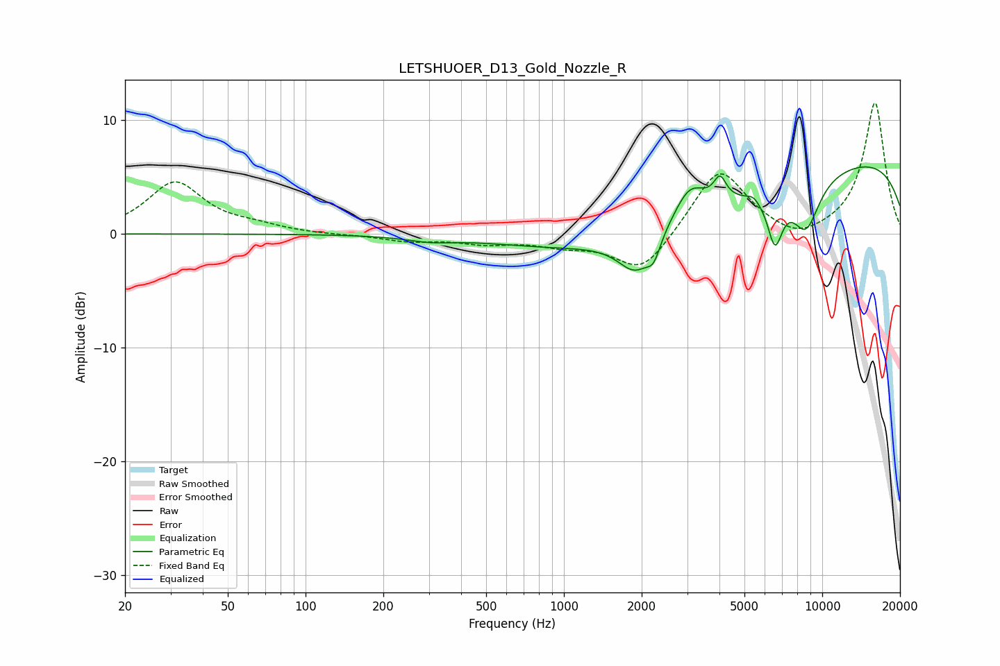

# LETSHUOER_D13_Gold_Nozzle_R
See [usage instructions](https://github.com/jaakkopasanen/AutoEq#usage) for more options and info.

### Parametric EQs
Apply preamp of -6.0 dB when using parametric equalizer.

|   # | Type    |   Fc (Hz) |    Q |   Gain (dB) |
|-----|---------|-----------|------|-------------|
|   1 | Peaking |       304 | 1.6  |        -0.4 |
|   2 | Peaking |      1902 | 2.03 |        -3.4 |
|   3 | Peaking |      2228 | 5.48 |        -1.6 |
|   4 | Peaking |      3065 | 2.39 |         2.7 |
|   5 | Peaking |      3214 | 0.23 |        -3.3 |
|   6 | Peaking |      4018 | 5.97 |         1.9 |
|   7 | Peaking |      5403 | 5.98 |         0.4 |
|   8 | Peaking |      6563 | 4.64 |        -4.4 |
|   9 | Peaking |      8647 | 2.41 |        -4.4 |
|  10 | Peaking |      9853 | 0.19 |         7.6 |

### Fixed Band EQs
When using fixed band (also called graphic) equalizer, apply preamp of **-11.6 dB** (if available) and set gains manually with these parameters.

|   # | Type    |   Fc (Hz) |    Q |   Gain (dB) |
|-----|---------|-----------|------|-------------|
|   1 | Peaking |        31 | 1.41 |         4.5 |
|   2 | Peaking |        62 | 1.41 |         0.5 |
|   3 | Peaking |       125 | 1.41 |        -0.1 |
|   4 | Peaking |       250 | 1.41 |        -0.6 |
|   5 | Peaking |       500 | 1.41 |        -0.7 |
|   6 | Peaking |      1000 | 1.41 |        -0.8 |
|   7 | Peaking |      2000 | 1.41 |        -3.5 |
|   8 | Peaking |      4000 | 1.41 |         5.9 |
|   9 | Peaking |      8000 | 1.41 |        -1   |
|  10 | Peaking |     16000 | 1.41 |        11.6 |

### Graphs

