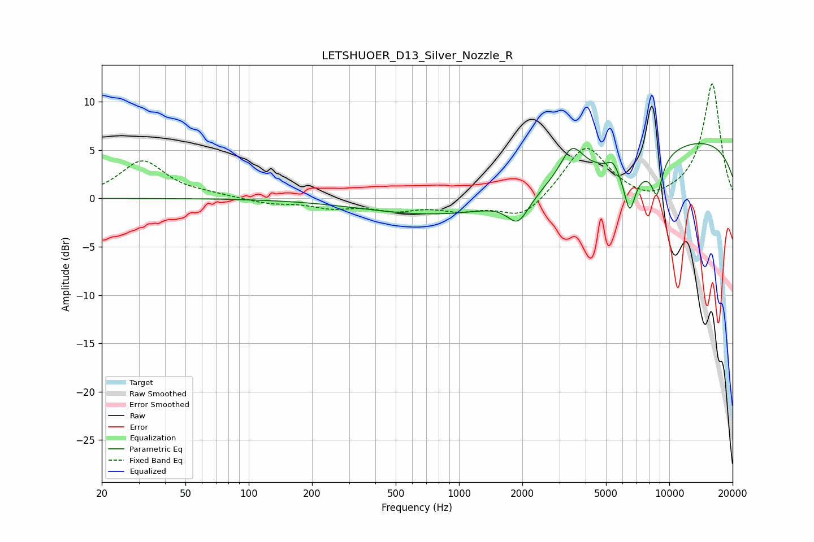

# LETSHUOER_D13_Silver_Nozzle_R
See [usage instructions](https://github.com/jaakkopasanen/AutoEq#usage) for more options and info.

### Parametric EQs
Apply preamp of -5.8 dB when using parametric equalizer.

|   # | Type    |   Fc (Hz) |    Q |   Gain (dB) |
|-----|---------|-----------|------|-------------|
|   1 | Peaking |      1101 | 1.61 |        -0   |
|   2 | Peaking |      1855 | 0.21 |        -2.7 |
|   3 | Peaking |      1899 | 2.92 |        -2.1 |
|   4 | Peaking |      1981 | 2.14 |        -0.7 |
|   5 | Peaking |      3436 | 2.63 |         3.2 |
|   6 | Peaking |      5378 | 6    |         0.9 |
|   7 | Peaking |      6475 | 4.96 |        -4.4 |
|   8 | Peaking |      7631 | 1.47 |        -1.7 |
|   9 | Peaking |      8742 | 5.25 |        -3.4 |
|  10 | Peaking |     10000 | 0.18 |         6.6 |

### Fixed Band EQs
When using fixed band (also called graphic) equalizer, apply preamp of **-12.0 dB** (if available) and set gains manually with these parameters.

|   # | Type    |   Fc (Hz) |    Q |   Gain (dB) |
|-----|---------|-----------|------|-------------|
|   1 | Peaking |        31 | 1.41 |         3.9 |
|   2 | Peaking |        62 | 1.41 |         0.3 |
|   3 | Peaking |       125 | 1.41 |        -0.5 |
|   4 | Peaking |       250 | 1.41 |        -0.8 |
|   5 | Peaking |       500 | 1.41 |        -1   |
|   6 | Peaking |      1000 | 1.41 |        -1   |
|   7 | Peaking |      2000 | 1.41 |        -2.2 |
|   8 | Peaking |      4000 | 1.41 |         5.5 |
|   9 | Peaking |      8000 | 1.41 |        -0.7 |
|  10 | Peaking |     16000 | 1.41 |        11.9 |

### Graphs

