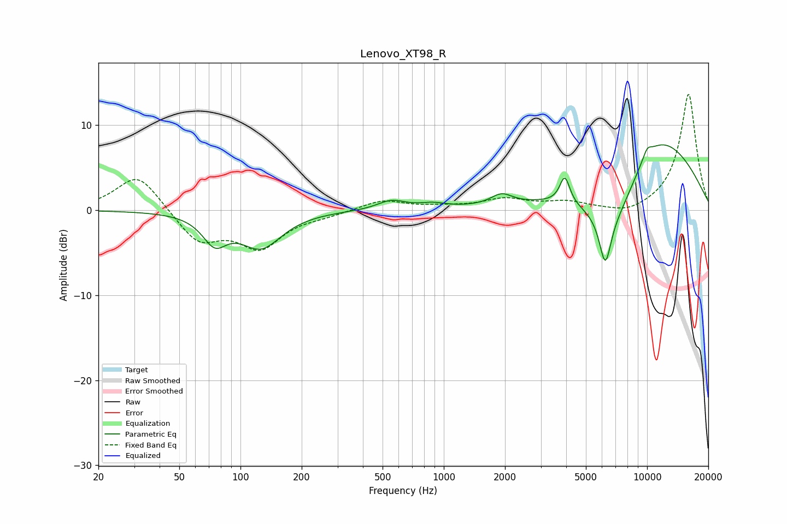

# Lenovo_XT98_R
See [usage instructions](https://github.com/jaakkopasanen/AutoEq#usage) for more options and info.

### Parametric EQs
Apply preamp of -7.8 dB when using parametric equalizer.

|   # | Type    |   Fc (Hz) |    Q |   Gain (dB) |
|-----|---------|-----------|------|-------------|
|   1 | Peaking |        75 | 2.41 |        -3.2 |
|   2 | Peaking |       126 | 1.37 |        -4.2 |
|   3 | Peaking |       553 | 2.05 |         1.1 |
|   4 | Peaking |       881 | 2.15 |         0.5 |
|   5 | Peaking |      1923 | 2.78 |         1.2 |
|   6 | Peaking |      3938 | 5.75 |         3.2 |
|   7 | Peaking |      6228 | 4.69 |        -5.8 |
|   8 | Peaking |      7025 | 0.82 |        -9.8 |
|   9 | Peaking |     10000 | 5.41 |         1.1 |
|  10 | Peaking |     10000 | 0.45 |        12.3 |

### Fixed Band EQs
When using fixed band (also called graphic) equalizer, apply preamp of **-13.7 dB** (if available) and set gains manually with these parameters.

|   # | Type    |   Fc (Hz) |    Q |   Gain (dB) |
|-----|---------|-----------|------|-------------|
|   1 | Peaking |        31 | 1.41 |         4.4 |
|   2 | Peaking |        62 | 1.41 |        -3.7 |
|   3 | Peaking |       125 | 1.41 |        -4.1 |
|   4 | Peaking |       250 | 1.41 |        -0.5 |
|   5 | Peaking |       500 | 1.41 |         1.2 |
|   6 | Peaking |      1000 | 1.41 |         0.3 |
|   7 | Peaking |      2000 | 1.41 |         1.2 |
|   8 | Peaking |      4000 | 1.41 |         0.9 |
|   9 | Peaking |      8000 | 1.41 |        -0.8 |
|  10 | Peaking |     16000 | 1.41 |        13.8 |

### Graphs

