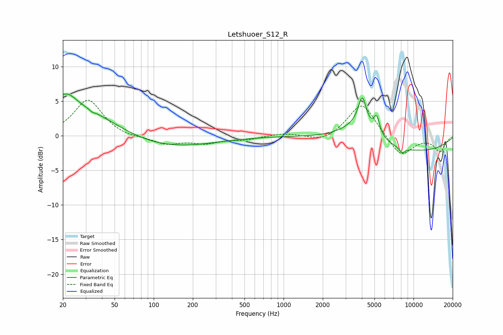

# Letshuoer_S12_R
See [usage instructions](https://github.com/jaakkopasanen/AutoEq#usage) for more options and info.

### Parametric EQs
Apply preamp of -6.2 dB when using parametric equalizer.

|   # | Type    |   Fc (Hz) |    Q |   Gain (dB) |
|-----|---------|-----------|------|-------------|
|   1 | Peaking |        21 | 2.14 |         1.8 |
|   2 | Peaking |        23 | 0.41 |         4.8 |
|   3 | Peaking |        34 | 5.92 |        -2.7 |
|   4 | Peaking |        34 | 5.94 |         2.5 |
|   5 | Peaking |       103 | 0.36 |        -2.1 |
|   6 | Peaking |      3768 | 1.09 |         2.3 |
|   7 | Peaking |      4030 | 4.46 |         4.3 |
|   8 | Peaking |      5201 | 6    |         2.5 |
|   9 | Peaking |      8161 | 5.78 |        -0.8 |
|  10 | Peaking |     10000 | 0.33 |        -2.3 |

### Fixed Band EQs
When using fixed band (also called graphic) equalizer, apply preamp of **-5.2 dB** (if available) and set gains manually with these parameters.

|   # | Type    |   Fc (Hz) |    Q |   Gain (dB) |
|-----|---------|-----------|------|-------------|
|   1 | Peaking |        31 | 1.41 |         5.3 |
|   2 | Peaking |        62 | 1.41 |        -0.3 |
|   3 | Peaking |       125 | 1.41 |        -1.2 |
|   4 | Peaking |       250 | 1.41 |        -1   |
|   5 | Peaking |       500 | 1.41 |        -0.5 |
|   6 | Peaking |      1000 | 1.41 |         0.4 |
|   7 | Peaking |      2000 | 1.41 |        -1   |
|   8 | Peaking |      4000 | 1.41 |         4.9 |
|   9 | Peaking |      8000 | 1.41 |        -3.1 |
|  10 | Peaking |     16000 | 1.41 |        -2.2 |

### Graphs

