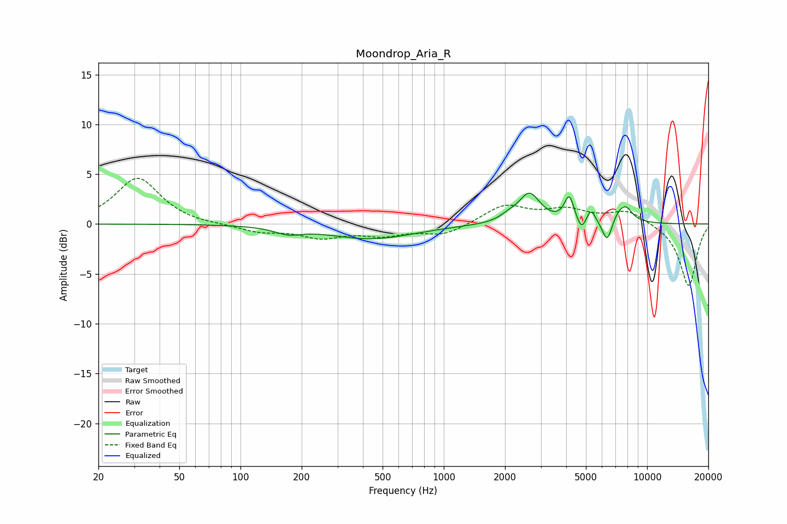

# Moondrop_Aria_R
See [usage instructions](https://github.com/jaakkopasanen/AutoEq#usage) for more options and info.

### Parametric EQs
Apply preamp of -3.2 dB when using parametric equalizer.

|   # | Type    |   Fc (Hz) |    Q |   Gain (dB) |
|-----|---------|-----------|------|-------------|
|   1 | Peaking |       171 | 2.23 |        -0.6 |
|   2 | Peaking |       440 | 0.67 |        -1.5 |
|   3 | Peaking |      2084 | 3.33 |         0.5 |
|   4 | Peaking |      2639 | 2.7  |         3   |
|   5 | Peaking |      4142 | 6    |         2.6 |
|   6 | Peaking |      4766 | 5.99 |        -1.4 |
|   7 | Peaking |      5285 | 6    |         1.4 |
|   8 | Peaking |      6367 | 5.5  |        -2.4 |
|   9 | Peaking |      7379 | 2.88 |         1.4 |
|  10 | Peaking |      7946 | 4.75 |         0.7 |

### Fixed Band EQs
When using fixed band (also called graphic) equalizer, apply preamp of **-4.7 dB** (if available) and set gains manually with these parameters.

|   # | Type    |   Fc (Hz) |    Q |   Gain (dB) |
|-----|---------|-----------|------|-------------|
|   1 | Peaking |        31 | 1.41 |         4.6 |
|   2 | Peaking |        62 | 1.41 |        -0.1 |
|   3 | Peaking |       125 | 1.41 |        -0.7 |
|   4 | Peaking |       250 | 1.41 |        -1.2 |
|   5 | Peaking |       500 | 1.41 |        -1   |
|   6 | Peaking |      1000 | 1.41 |        -1.1 |
|   7 | Peaking |      2000 | 1.41 |         1.9 |
|   8 | Peaking |      4000 | 1.41 |         1.3 |
|   9 | Peaking |      8000 | 1.41 |         1.3 |
|  10 | Peaking |     16000 | 1.41 |        -6.3 |

### Graphs

