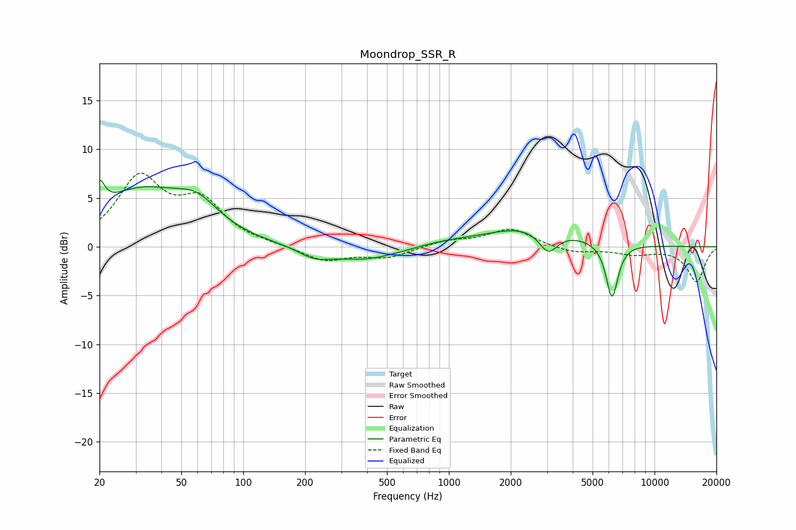

# Moondrop_SSR_R
See [usage instructions](https://github.com/jaakkopasanen/AutoEq#usage) for more options and info.

### Parametric EQs
Apply preamp of -6.9 dB when using parametric equalizer.

|   # | Type    |   Fc (Hz) |    Q |   Gain (dB) |
|-----|---------|-----------|------|-------------|
|   1 | Peaking |        20 | 5.95 |         2.6 |
|   2 | Peaking |        32 | 0.61 |         5.5 |
|   3 | Peaking |        60 | 1.4  |         2.4 |
|   4 | Peaking |       222 | 1.86 |        -1   |
|   5 | Peaking |       390 | 0.82 |        -1.4 |
|   6 | Peaking |       916 | 1.05 |         0.4 |
|   7 | Peaking |      2498 | 5.89 |         0   |
|   8 | Peaking |      2509 | 0.65 |         2.1 |
|   9 | Peaking |      3043 | 3.02 |        -2.3 |
|  10 | Peaking |      6216 | 4.69 |        -5.7 |

### Fixed Band EQs
When using fixed band (also called graphic) equalizer, apply preamp of **-7.6 dB** (if available) and set gains manually with these parameters.

|   # | Type    |   Fc (Hz) |    Q |   Gain (dB) |
|-----|---------|-----------|------|-------------|
|   1 | Peaking |        31 | 1.41 |         6.8 |
|   2 | Peaking |        62 | 1.41 |         4.2 |
|   3 | Peaking |       125 | 1.41 |         0.1 |
|   4 | Peaking |       250 | 1.41 |        -1.5 |
|   5 | Peaking |       500 | 1.41 |        -1.1 |
|   6 | Peaking |      1000 | 1.41 |         0.6 |
|   7 | Peaking |      2000 | 1.41 |         1.9 |
|   8 | Peaking |      4000 | 1.41 |        -0.6 |
|   9 | Peaking |      8000 | 1.41 |        -0.7 |
|  10 | Peaking |     16000 | 1.41 |        -3.6 |

### Graphs

