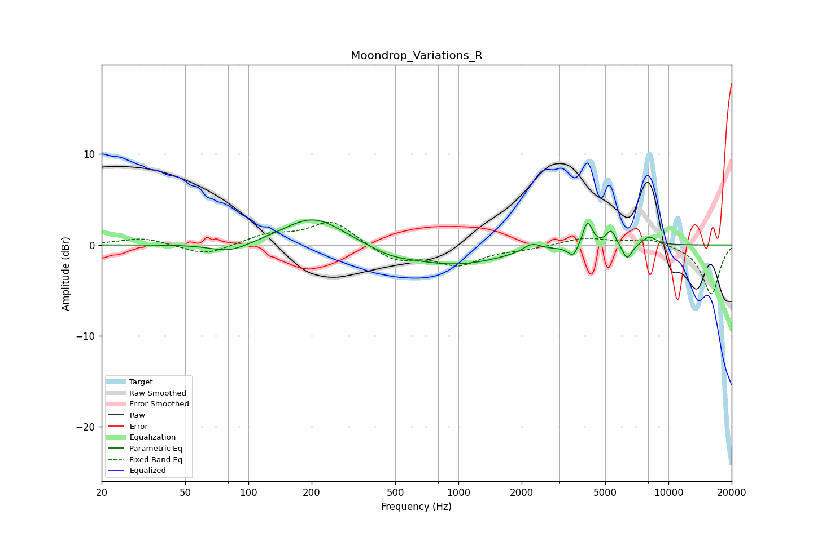

# Moondrop_Variations_R
See [usage instructions](https://github.com/jaakkopasanen/AutoEq#usage) for more options and info.

### Parametric EQs
Apply preamp of -2.8 dB when using parametric equalizer.

|   # | Type    |   Fc (Hz) |    Q |   Gain (dB) |
|-----|---------|-----------|------|-------------|
|   1 | Peaking |        82 | 1.52 |        -1   |
|   2 | Peaking |       204 | 0.99 |         3.2 |
|   3 | Peaking |       476 | 1.47 |        -0.7 |
|   4 | Peaking |       949 | 0.6  |        -2.2 |
|   5 | Peaking |      2239 | 3.34 |         0.9 |
|   6 | Peaking |      3522 | 5.8  |        -1.3 |
|   7 | Peaking |      4113 | 6    |         2.8 |
|   8 | Peaking |      5335 | 6    |         1.7 |
|   9 | Peaking |      6350 | 5.9  |        -1.7 |
|  10 | Peaking |      8107 | 3.78 |         1   |

### Fixed Band EQs
When using fixed band (also called graphic) equalizer, apply preamp of **-2.6 dB** (if available) and set gains manually with these parameters.

|   # | Type    |   Fc (Hz) |    Q |   Gain (dB) |
|-----|---------|-----------|------|-------------|
|   1 | Peaking |        31 | 1.41 |         0.8 |
|   2 | Peaking |        62 | 1.41 |        -1.2 |
|   3 | Peaking |       125 | 1.41 |         1.1 |
|   4 | Peaking |       250 | 1.41 |         2.7 |
|   5 | Peaking |       500 | 1.41 |        -1.7 |
|   6 | Peaking |      1000 | 1.41 |        -2.1 |
|   7 | Peaking |      2000 | 1.41 |        -0.4 |
|   8 | Peaking |      4000 | 1.41 |         0.8 |
|   9 | Peaking |      8000 | 1.41 |         0.7 |
|  10 | Peaking |     16000 | 1.41 |        -5.5 |

### Graphs

