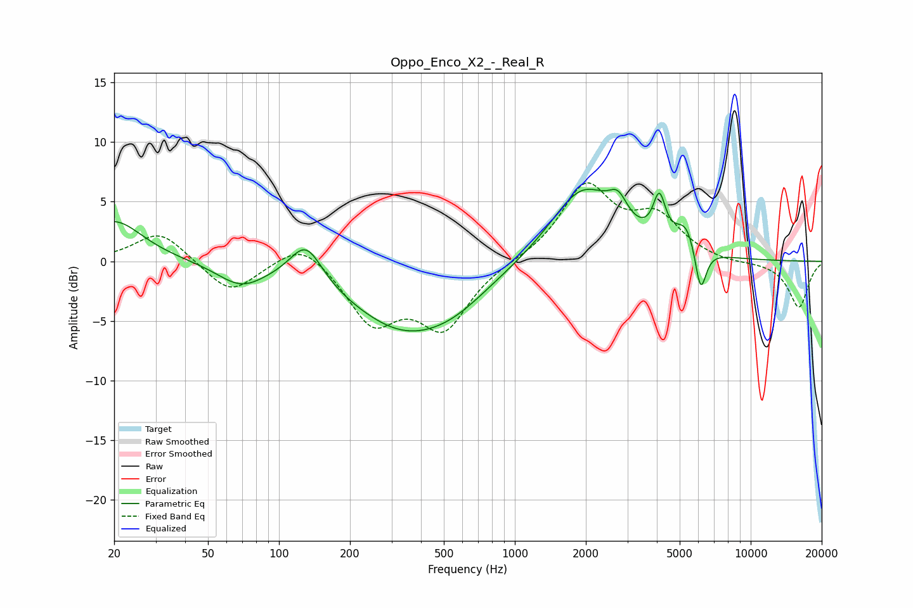

# Oppo_Enco_X2_-_Real_R
See [usage instructions](https://github.com/jaakkopasanen/AutoEq#usage) for more options and info.

### Parametric EQs
Apply preamp of -6.1 dB when using parametric equalizer.

|   # | Type    |   Fc (Hz) |    Q |   Gain (dB) |
|-----|---------|-----------|------|-------------|
|   1 | Peaking |        20 | 1.18 |         3.5 |
|   2 | Peaking |        69 | 1.43 |        -1.8 |
|   3 | Peaking |       130 | 2.04 |         3.4 |
|   4 | Peaking |       346 | 0.58 |        -5.7 |
|   5 | Peaking |       563 | 1.04 |        -1   |
|   6 | Peaking |      1941 | 1.01 |         6.2 |
|   7 | Peaking |      2738 | 3.55 |         1.9 |
|   8 | Peaking |      4098 | 5.37 |         3.6 |
|   9 | Peaking |      5337 | 2.99 |         2.4 |
|  10 | Peaking |      6129 | 5.72 |        -4   |

### Fixed Band EQs
When using fixed band (also called graphic) equalizer, apply preamp of **-6.7 dB** (if available) and set gains manually with these parameters.

|   # | Type    |   Fc (Hz) |    Q |   Gain (dB) |
|-----|---------|-----------|------|-------------|
|   1 | Peaking |        31 | 1.41 |         2.6 |
|   2 | Peaking |        62 | 1.41 |        -2.8 |
|   3 | Peaking |       125 | 1.41 |         2   |
|   4 | Peaking |       250 | 1.41 |        -4.9 |
|   5 | Peaking |       500 | 1.41 |        -5.3 |
|   6 | Peaking |      1000 | 1.41 |         0   |
|   7 | Peaking |      2000 | 1.41 |         6.2 |
|   8 | Peaking |      4000 | 1.41 |         3.3 |
|   9 | Peaking |      8000 | 1.41 |        -0.2 |
|  10 | Peaking |     16000 | 1.41 |        -3.9 |

### Graphs

