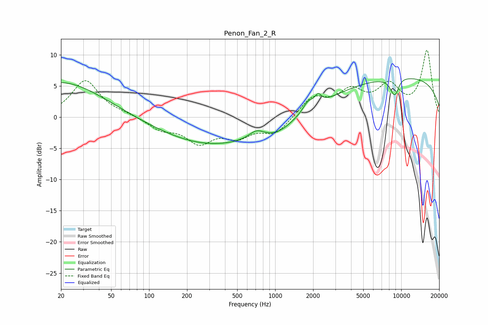

# Penon_Fan_2_R
See [usage instructions](https://github.com/jaakkopasanen/AutoEq#usage) for more options and info.

### Parametric EQs
Apply preamp of -6.3 dB when using parametric equalizer.

|   # | Type    |   Fc (Hz) |    Q |   Gain (dB) |
|-----|---------|-----------|------|-------------|
|   1 | Peaking |        20 | 0.42 |         5.7 |
|   2 | Peaking |       326 | 0.33 |        -4.4 |
|   3 | Peaking |       710 | 2.47 |         1.2 |
|   4 | Peaking |      1056 | 1.23 |        -1.3 |
|   5 | Peaking |      1826 | 3.35 |         1.5 |
|   6 | Peaking |      2193 | 5.86 |         1.4 |
|   7 | Peaking |      8847 | 5.64 |         2.6 |
|   8 | Peaking |      8854 | 4.52 |        -5.5 |
|   9 | Peaking |     10000 | 0.21 |         6.5 |
|  10 | Peaking |     10000 | 3.18 |         0.2 |

### Fixed Band EQs
When using fixed band (also called graphic) equalizer, apply preamp of **-10.8 dB** (if available) and set gains manually with these parameters.

|   # | Type    |   Fc (Hz) |    Q |   Gain (dB) |
|-----|---------|-----------|------|-------------|
|   1 | Peaking |        31 | 1.41 |         5.9 |
|   2 | Peaking |        62 | 1.41 |         0.4 |
|   3 | Peaking |       125 | 1.41 |        -1.8 |
|   4 | Peaking |       250 | 1.41 |        -3.7 |
|   5 | Peaking |       500 | 1.41 |        -2.7 |
|   6 | Peaking |      1000 | 1.41 |        -2.6 |
|   7 | Peaking |      2000 | 1.41 |         3.1 |
|   8 | Peaking |      4000 | 1.41 |         3.7 |
|   9 | Peaking |      8000 | 1.41 |         4.6 |
|  10 | Peaking |     16000 | 1.41 |        10.5 |

### Graphs

