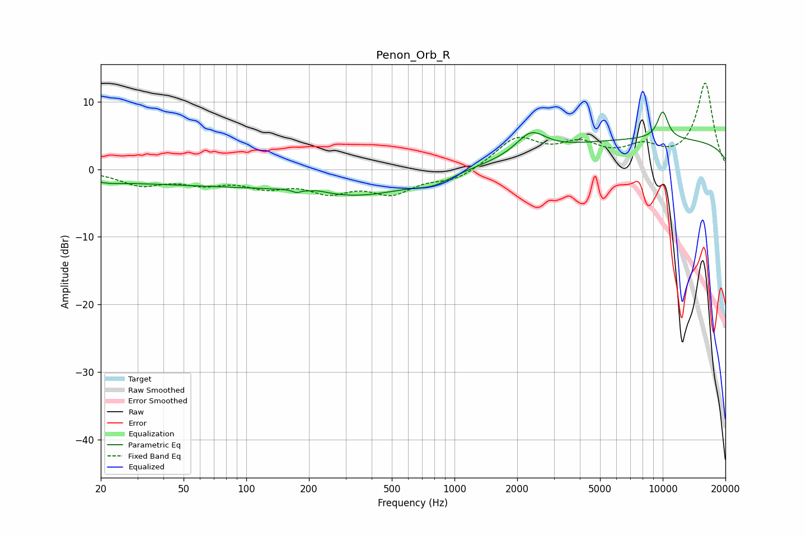

# Penon_Orb_R
See [usage instructions](https://github.com/jaakkopasanen/AutoEq#usage) for more options and info.

### Parametric EQs
Apply preamp of -8.6 dB when using parametric equalizer.

|   # | Type    |   Fc (Hz) |    Q |   Gain (dB) |
|-----|---------|-----------|------|-------------|
|   1 | Peaking |        22 | 2.19 |        -0.4 |
|   2 | Peaking |        76 | 0.19 |        -2.3 |
|   3 | Peaking |       175 | 5.96 |        -0.7 |
|   4 | Peaking |       197 | 2.24 |         1   |
|   5 | Peaking |       201 | 5.21 |        -0.4 |
|   6 | Peaking |       371 | 0.57 |        -2.6 |
|   7 | Peaking |       795 | 1.66 |        -1.2 |
|   8 | Peaking |      2330 | 2.02 |         3.3 |
|   9 | Peaking |     10000 | 0.18 |         4.4 |
|  10 | Peaking |     10000 | 4.56 |         4.1 |

### Fixed Band EQs
When using fixed band (also called graphic) equalizer, apply preamp of **-12.9 dB** (if available) and set gains manually with these parameters.

|   # | Type    |   Fc (Hz) |    Q |   Gain (dB) |
|-----|---------|-----------|------|-------------|
|   1 | Peaking |        31 | 1.41 |        -2.1 |
|   2 | Peaking |        62 | 1.41 |        -1.7 |
|   3 | Peaking |       125 | 1.41 |        -2.1 |
|   4 | Peaking |       250 | 1.41 |        -2.8 |
|   5 | Peaking |       500 | 1.41 |        -3.2 |
|   6 | Peaking |      1000 | 1.41 |        -1.6 |
|   7 | Peaking |      2000 | 1.41 |         4.5 |
|   8 | Peaking |      4000 | 1.41 |         3.2 |
|   9 | Peaking |      8000 | 1.41 |         2.7 |
|  10 | Peaking |     16000 | 1.41 |        12.7 |

### Graphs

