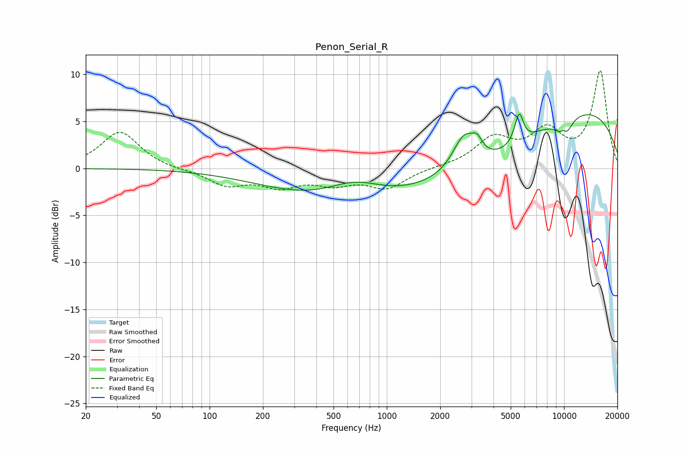

# Penon_Serial_R
See [usage instructions](https://github.com/jaakkopasanen/AutoEq#usage) for more options and info.

### Parametric EQs
Apply preamp of -5.8 dB when using parametric equalizer.

|   # | Type    |   Fc (Hz) |    Q |   Gain (dB) |
|-----|---------|-----------|------|-------------|
|   1 | Peaking |       633 | 0.32 |        -3.7 |
|   2 | Peaking |       661 | 0.88 |         2.2 |
|   3 | Peaking |      2725 | 2.18 |         3.8 |
|   4 | Peaking |      3233 | 4.62 |         1.4 |
|   5 | Peaking |      4221 | 0.48 |        -3.6 |
|   6 | Peaking |      5245 | 6    |         0.2 |
|   7 | Peaking |      5586 | 6    |         3   |
|   8 | Peaking |      9931 | 5.58 |         1.7 |
|   9 | Peaking |     10000 | 0.24 |         7   |
|  10 | Peaking |     10000 | 3.38 |        -3.1 |

### Fixed Band EQs
When using fixed band (also called graphic) equalizer, apply preamp of **-10.5 dB** (if available) and set gains manually with these parameters.

|   # | Type    |   Fc (Hz) |    Q |   Gain (dB) |
|-----|---------|-----------|------|-------------|
|   1 | Peaking |        31 | 1.41 |         3.9 |
|   2 | Peaking |        62 | 1.41 |        -0.1 |
|   3 | Peaking |       125 | 1.41 |        -1.7 |
|   4 | Peaking |       250 | 1.41 |        -1.7 |
|   5 | Peaking |       500 | 1.41 |        -1.4 |
|   6 | Peaking |      1000 | 1.41 |        -2   |
|   7 | Peaking |      2000 | 1.41 |         0.1 |
|   8 | Peaking |      4000 | 1.41 |         3   |
|   9 | Peaking |      8000 | 1.41 |         3.6 |
|  10 | Peaking |     16000 | 1.41 |        10.2 |

### Graphs

