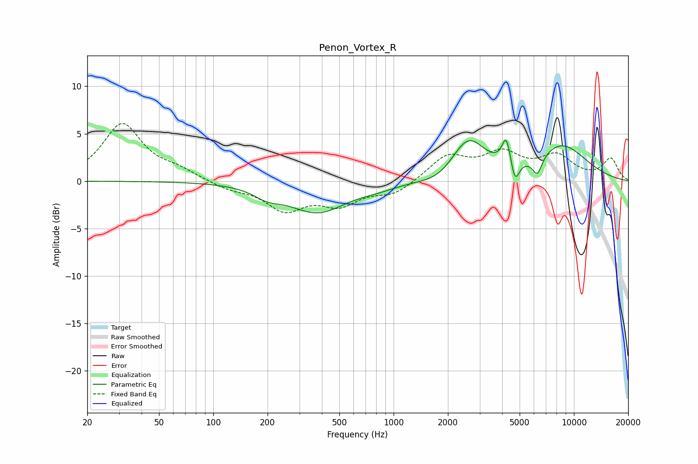

# Penon_Vortex_R
See [usage instructions](https://github.com/jaakkopasanen/AutoEq#usage) for more options and info.

### Parametric EQs
Apply preamp of -4.4 dB when using parametric equalizer.

|   # | Type    |   Fc (Hz) |    Q |   Gain (dB) |
|-----|---------|-----------|------|-------------|
|   1 | Peaking |       199 | 1.89 |        -0.9 |
|   2 | Peaking |       378 | 0.88 |        -3.2 |
|   3 | Peaking |       816 | 1.37 |        -0.4 |
|   4 | Peaking |      1835 | 1.32 |        -1   |
|   5 | Peaking |      2582 | 1.48 |         4.4 |
|   6 | Peaking |      4206 | 6    |         1.9 |
|   7 | Peaking |      4246 | 6    |         1   |
|   8 | Peaking |      4711 | 6    |        -2.4 |
|   9 | Peaking |      6265 | 4.91 |        -2   |
|  10 | Peaking |      8514 | 0.86 |         3.7 |

### Fixed Band EQs
When using fixed band (also called graphic) equalizer, apply preamp of **-6.2 dB** (if available) and set gains manually with these parameters.

|   # | Type    |   Fc (Hz) |    Q |   Gain (dB) |
|-----|---------|-----------|------|-------------|
|   1 | Peaking |        31 | 1.41 |         6   |
|   2 | Peaking |        62 | 1.41 |         0.9 |
|   3 | Peaking |       125 | 1.41 |        -0.8 |
|   4 | Peaking |       250 | 1.41 |        -2.9 |
|   5 | Peaking |       500 | 1.41 |        -2.2 |
|   6 | Peaking |      1000 | 1.41 |        -1.3 |
|   7 | Peaking |      2000 | 1.41 |         2.6 |
|   8 | Peaking |      4000 | 1.41 |         2.6 |
|   9 | Peaking |      8000 | 1.41 |         2.4 |
|  10 | Peaking |     16000 | 1.41 |         2.3 |

### Graphs

