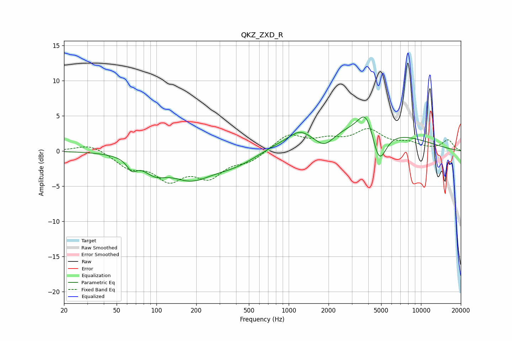

# QKZ_ZXD_R
See [usage instructions](https://github.com/jaakkopasanen/AutoEq#usage) for more options and info.

### Parametric EQs
Apply preamp of -4.9 dB when using parametric equalizer.

|   # | Type    |   Fc (Hz) |    Q |   Gain (dB) |
|-----|---------|-----------|------|-------------|
|   1 | Peaking |        65 | 3.81 |        -1.5 |
|   2 | Peaking |        97 | 1.6  |        -2   |
|   3 | Peaking |       180 | 0.91 |        -3.2 |
|   4 | Peaking |       400 | 0.69 |        -2.2 |
|   5 | Peaking |      1182 | 2.32 |         0.9 |
|   6 | Peaking |      1352 | 3.18 |         0.1 |
|   7 | Peaking |      1863 | 1.86 |        -2.3 |
|   8 | Peaking |      2749 | 0.25 |         3.5 |
|   9 | Peaking |      3855 | 2.36 |         3.6 |
|  10 | Peaking |      4811 | 2.52 |        -5.3 |

### Fixed Band EQs
When using fixed band (also called graphic) equalizer, apply preamp of **-3.3 dB** (if available) and set gains manually with these parameters.

|   # | Type    |   Fc (Hz) |    Q |   Gain (dB) |
|-----|---------|-----------|------|-------------|
|   1 | Peaking |        31 | 1.41 |         1.1 |
|   2 | Peaking |        62 | 1.41 |        -2.1 |
|   3 | Peaking |       125 | 1.41 |        -3.6 |
|   4 | Peaking |       250 | 1.41 |        -3.3 |
|   5 | Peaking |       500 | 1.41 |        -1.3 |
|   6 | Peaking |      1000 | 1.41 |         2.3 |
|   7 | Peaking |      2000 | 1.41 |         1.3 |
|   8 | Peaking |      4000 | 1.41 |         2.8 |
|   9 | Peaking |      8000 | 1.41 |         1   |
|  10 | Peaking |     16000 | 1.41 |         1.5 |

### Graphs

