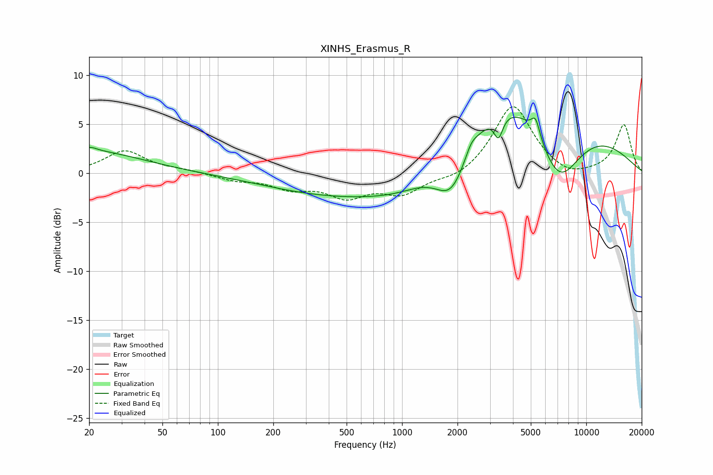

# XINHS_Erasmus_R
See [usage instructions](https://github.com/jaakkopasanen/AutoEq#usage) for more options and info.

### Parametric EQs
Apply preamp of -5.8 dB when using parametric equalizer.

|   # | Type    |   Fc (Hz) |    Q |   Gain (dB) |
|-----|---------|-----------|------|-------------|
|   1 | Peaking |        20 | 3.88 |         0.4 |
|   2 | Peaking |        20 | 0.5  |         2.2 |
|   3 | Peaking |       569 | 0.32 |        -2.5 |
|   4 | Peaking |      1045 | 0.7  |        -2   |
|   5 | Peaking |      1864 | 1.5  |        -5.5 |
|   6 | Peaking |      2375 | 4.64 |         0.9 |
|   7 | Peaking |      3339 | 5.91 |        -2.3 |
|   8 | Peaking |      4732 | 0.32 |        11.3 |
|   9 | Peaking |      5309 | 6    |         1.9 |
|  10 | Peaking |      7054 | 0.95 |        -9.7 |

### Fixed Band EQs
When using fixed band (also called graphic) equalizer, apply preamp of **-6.9 dB** (if available) and set gains manually with these parameters.

|   # | Type    |   Fc (Hz) |    Q |   Gain (dB) |
|-----|---------|-----------|------|-------------|
|   1 | Peaking |        31 | 1.41 |         2.3 |
|   2 | Peaking |        62 | 1.41 |         0.3 |
|   3 | Peaking |       125 | 1.41 |        -0.6 |
|   4 | Peaking |       250 | 1.41 |        -1.3 |
|   5 | Peaking |       500 | 1.41 |        -2.2 |
|   6 | Peaking |      1000 | 1.41 |        -2   |
|   7 | Peaking |      2000 | 1.41 |        -0.7 |
|   8 | Peaking |      4000 | 1.41 |         7.1 |
|   9 | Peaking |      8000 | 1.41 |        -0.7 |
|  10 | Peaking |     16000 | 1.41 |         4.9 |

### Graphs

