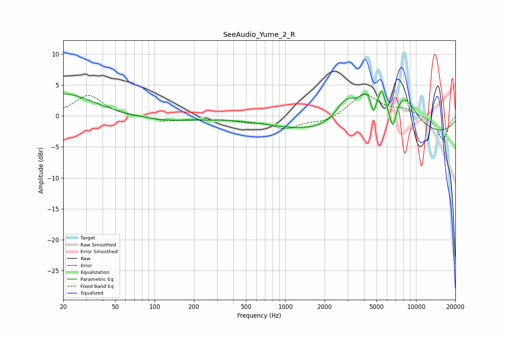

# SeeAudio_Yume_2_R
See [usage instructions](https://github.com/jaakkopasanen/AutoEq#usage) for more options and info.

### Parametric EQs
Apply preamp of -4.0 dB when using parametric equalizer.

|   # | Type    |   Fc (Hz) |    Q |   Gain (dB) |
|-----|---------|-----------|------|-------------|
|   1 | Peaking |        20 | 0.62 |         3.6 |
|   2 | Peaking |       123 | 0.56 |        -0.8 |
|   3 | Peaking |      1169 | 0.5  |        -1.3 |
|   4 | Peaking |      2905 | 1.77 |         3.9 |
|   5 | Peaking |      4399 | 1.91 |         5.7 |
|   6 | Peaking |      4701 | 5.99 |        -3.8 |
|   7 | Peaking |      5470 | 5.75 |         2.8 |
|   8 | Peaking |      6652 | 5.59 |        -3.8 |
|   9 | Peaking |      8105 | 1.31 |         5.6 |
|  10 | Peaking |      8578 | 0.18 |        -3.3 |

### Fixed Band EQs
When using fixed band (also called graphic) equalizer, apply preamp of **-3.6 dB** (if available) and set gains manually with these parameters.

|   # | Type    |   Fc (Hz) |    Q |   Gain (dB) |
|-----|---------|-----------|------|-------------|
|   1 | Peaking |        31 | 1.41 |         3.4 |
|   2 | Peaking |        62 | 1.41 |        -0.2 |
|   3 | Peaking |       125 | 1.41 |        -0.8 |
|   4 | Peaking |       250 | 1.41 |        -0.4 |
|   5 | Peaking |       500 | 1.41 |        -0.7 |
|   6 | Peaking |      1000 | 1.41 |        -1.9 |
|   7 | Peaking |      2000 | 1.41 |        -0.9 |
|   8 | Peaking |      4000 | 1.41 |         3.6 |
|   9 | Peaking |      8000 | 1.41 |         1   |
|  10 | Peaking |     16000 | 1.41 |        -3.9 |

### Graphs

