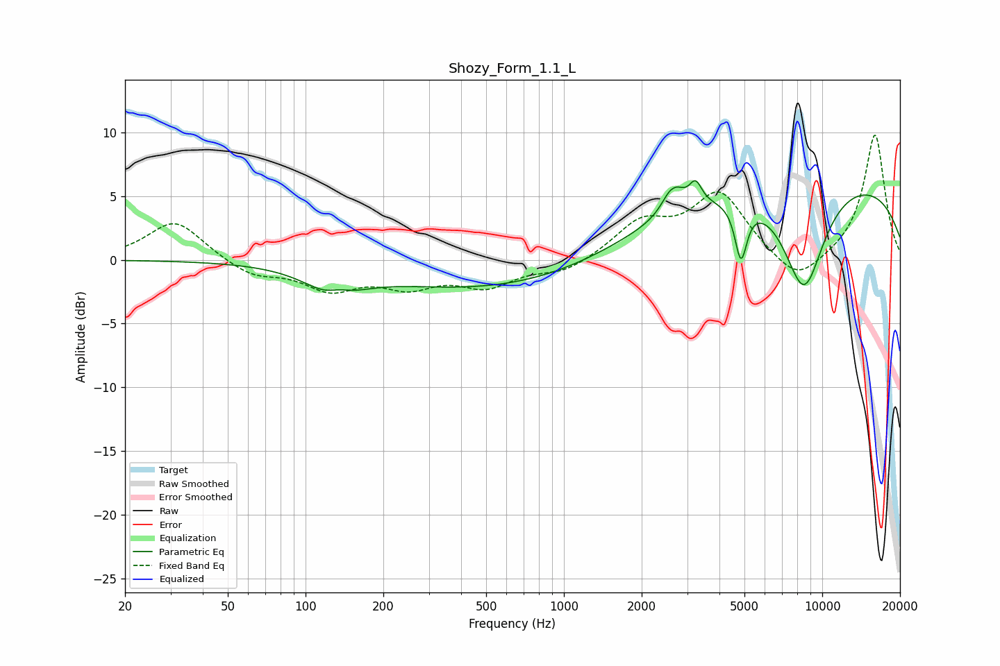

# Shozy_Form_1.1_L
See [usage instructions](https://github.com/jaakkopasanen/AutoEq#usage) for more options and info.

### Parametric EQs
Apply preamp of -6.3 dB when using parametric equalizer.

|   # | Type    |   Fc (Hz) |    Q |   Gain (dB) |
|-----|---------|-----------|------|-------------|
|   1 | Peaking |       129 | 1.4  |        -2   |
|   2 | Peaking |       135 | 3.15 |         0.6 |
|   3 | Peaking |       584 | 0.3  |        -2.5 |
|   4 | Peaking |      2638 | 5.93 |        -1   |
|   5 | Peaking |      2646 | 4.27 |         3.3 |
|   6 | Peaking |      2680 | 5.59 |        -0.4 |
|   7 | Peaking |      3233 | 5.9  |         1.7 |
|   8 | Peaking |      4846 | 6    |        -4.4 |
|   9 | Peaking |      8494 | 1.56 |        -8.6 |
|  10 | Peaking |      8788 | 0.18 |         6.8 |

### Fixed Band EQs
When using fixed band (also called graphic) equalizer, apply preamp of **-9.9 dB** (if available) and set gains manually with these parameters.

|   # | Type    |   Fc (Hz) |    Q |   Gain (dB) |
|-----|---------|-----------|------|-------------|
|   1 | Peaking |        31 | 1.41 |         3.1 |
|   2 | Peaking |        62 | 1.41 |        -1.2 |
|   3 | Peaking |       125 | 1.41 |        -2.1 |
|   4 | Peaking |       250 | 1.41 |        -1.8 |
|   5 | Peaking |       500 | 1.41 |        -1.9 |
|   6 | Peaking |      1000 | 1.41 |        -1   |
|   7 | Peaking |      2000 | 1.41 |         2.7 |
|   8 | Peaking |      4000 | 1.41 |         5.1 |
|   9 | Peaking |      8000 | 1.41 |        -2.2 |
|  10 | Peaking |     16000 | 1.41 |         9.9 |

### Graphs

