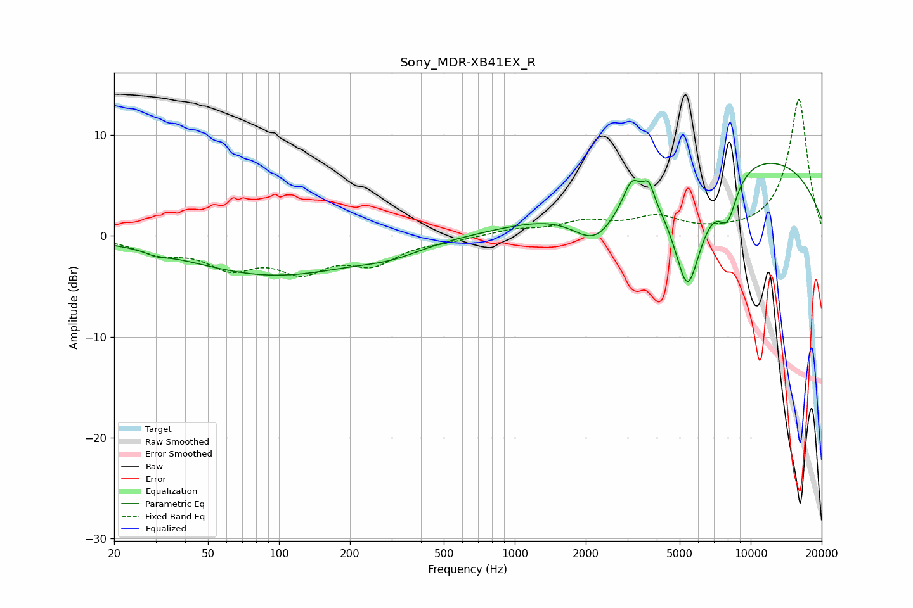

# Sony_MDR-XB41EX_R
See [usage instructions](https://github.com/jaakkopasanen/AutoEq#usage) for more options and info.

### Parametric EQs
Apply preamp of -7.3 dB when using parametric equalizer.

|   # | Type    |   Fc (Hz) |    Q |   Gain (dB) |
|-----|---------|-----------|------|-------------|
|   1 | Peaking |        30 | 3.6  |        -0.4 |
|   2 | Peaking |        94 | 0.4  |        -3.8 |
|   3 | Peaking |       300 | 1.05 |        -0.9 |
|   4 | Peaking |      2203 | 1.37 |        -4.5 |
|   5 | Peaking |      3132 | 3.96 |         2.7 |
|   6 | Peaking |      3688 | 5.95 |         2   |
|   7 | Peaking |      5398 | 2.07 |       -11.9 |
|   8 | Peaking |      6681 | 2.41 |        -0.3 |
|   9 | Peaking |      7979 | 3.25 |        -4.1 |
|  10 | Peaking |      8110 | 0.21 |         8.6 |

### Fixed Band EQs
When using fixed band (also called graphic) equalizer, apply preamp of **-13.6 dB** (if available) and set gains manually with these parameters.

|   # | Type    |   Fc (Hz) |    Q |   Gain (dB) |
|-----|---------|-----------|------|-------------|
|   1 | Peaking |        31 | 1.41 |        -1.4 |
|   2 | Peaking |        62 | 1.41 |        -2.7 |
|   3 | Peaking |       125 | 1.41 |        -3   |
|   4 | Peaking |       250 | 1.41 |        -2.4 |
|   5 | Peaking |       500 | 1.41 |        -0.4 |
|   6 | Peaking |      1000 | 1.41 |         0.6 |
|   7 | Peaking |      2000 | 1.41 |         1.3 |
|   8 | Peaking |      4000 | 1.41 |         1.7 |
|   9 | Peaking |      8000 | 1.41 |         0.2 |
|  10 | Peaking |     16000 | 1.41 |        13.6 |

### Graphs

