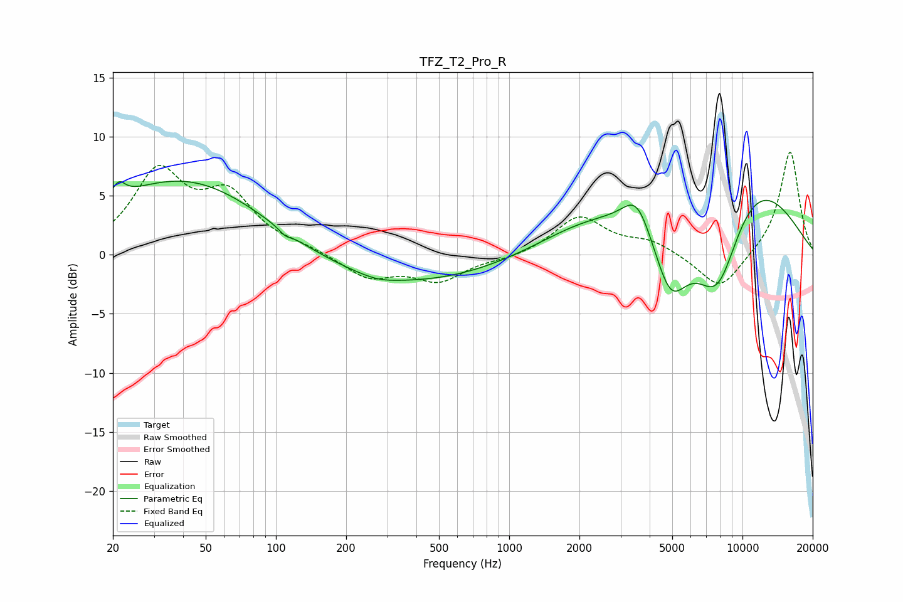

# TFZ_T2_Pro_R
See [usage instructions](https://github.com/jaakkopasanen/AutoEq#usage) for more options and info.

### Parametric EQs
Apply preamp of -6.3 dB when using parametric equalizer.

|   # | Type    |   Fc (Hz) |    Q |   Gain (dB) |
|-----|---------|-----------|------|-------------|
|   1 | Peaking |        21 | 5.17 |         1.3 |
|   2 | Peaking |        44 | 0.37 |         7   |
|   3 | Peaking |       109 | 5.98 |        -0.4 |
|   4 | Peaking |       263 | 0.27 |        -3   |
|   5 | Peaking |       274 | 1.68 |        -0.4 |
|   6 | Peaking |      2269 | 0.62 |         2.6 |
|   7 | Peaking |      3531 | 2.23 |         3.1 |
|   8 | Peaking |      4914 | 1.86 |        -5.7 |
|   9 | Peaking |      7820 | 1.12 |       -10   |
|  10 | Peaking |      9707 | 0.5  |         8.9 |

### Fixed Band EQs
When using fixed band (also called graphic) equalizer, apply preamp of **-8.8 dB** (if available) and set gains manually with these parameters.

|   # | Type    |   Fc (Hz) |    Q |   Gain (dB) |
|-----|---------|-----------|------|-------------|
|   1 | Peaking |        31 | 1.41 |         6.7 |
|   2 | Peaking |        62 | 1.41 |         4.6 |
|   3 | Peaking |       125 | 1.41 |         0.5 |
|   4 | Peaking |       250 | 1.41 |        -1.9 |
|   5 | Peaking |       500 | 1.41 |        -2.1 |
|   6 | Peaking |      1000 | 1.41 |        -0.3 |
|   7 | Peaking |      2000 | 1.41 |         3.2 |
|   8 | Peaking |      4000 | 1.41 |         1.1 |
|   9 | Peaking |      8000 | 1.41 |        -3.1 |
|  10 | Peaking |     16000 | 1.41 |         8.9 |

### Graphs

