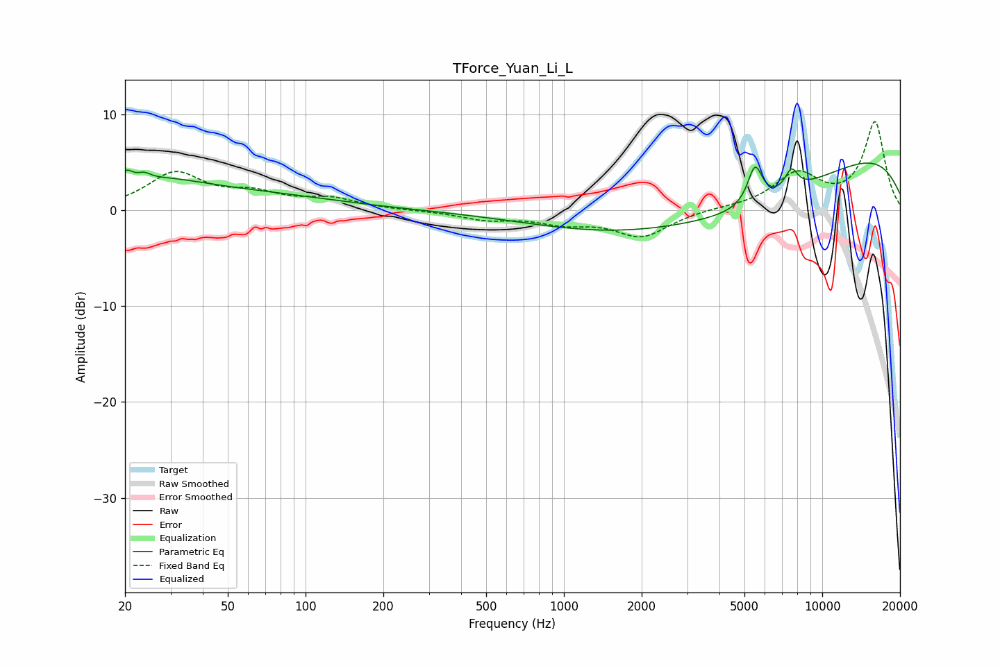

# TForce_Yuan_Li_L
See [usage instructions](https://github.com/jaakkopasanen/AutoEq#usage) for more options and info.

### Parametric EQs
Apply preamp of -5.0 dB when using parametric equalizer.

|   # | Type    |   Fc (Hz) |    Q |   Gain (dB) |
|-----|---------|-----------|------|-------------|
|   1 | Peaking |        20 | 5.81 |         1.2 |
|   2 | Peaking |        24 | 5.72 |         0.6 |
|   3 | Peaking |        27 | 0.9  |         1.2 |
|   4 | Peaking |        35 | 0.28 |         2.1 |
|   5 | Peaking |      3947 | 0.21 |        -3.9 |
|   6 | Peaking |      5160 | 0.47 |        -2.7 |
|   7 | Peaking |      5492 | 4.86 |         4   |
|   8 | Peaking |      7595 | 5.24 |         2.2 |
|   9 | Peaking |     10000 | 0.23 |         5.4 |
|  10 | Peaking |     10000 | 0.24 |         2.5 |

### Fixed Band EQs
When using fixed band (also called graphic) equalizer, apply preamp of **-9.3 dB** (if available) and set gains manually with these parameters.

|   # | Type    |   Fc (Hz) |    Q |   Gain (dB) |
|-----|---------|-----------|------|-------------|
|   1 | Peaking |        31 | 1.41 |         3.7 |
|   2 | Peaking |        62 | 1.41 |         1.5 |
|   3 | Peaking |       125 | 1.41 |         1.1 |
|   4 | Peaking |       250 | 1.41 |        -0   |
|   5 | Peaking |       500 | 1.41 |        -0.9 |
|   6 | Peaking |      1000 | 1.41 |        -1.1 |
|   7 | Peaking |      2000 | 1.41 |        -2.7 |
|   8 | Peaking |      4000 | 1.41 |         0.2 |
|   9 | Peaking |      8000 | 1.41 |         3.6 |
|  10 | Peaking |     16000 | 1.41 |         9.1 |

### Graphs

