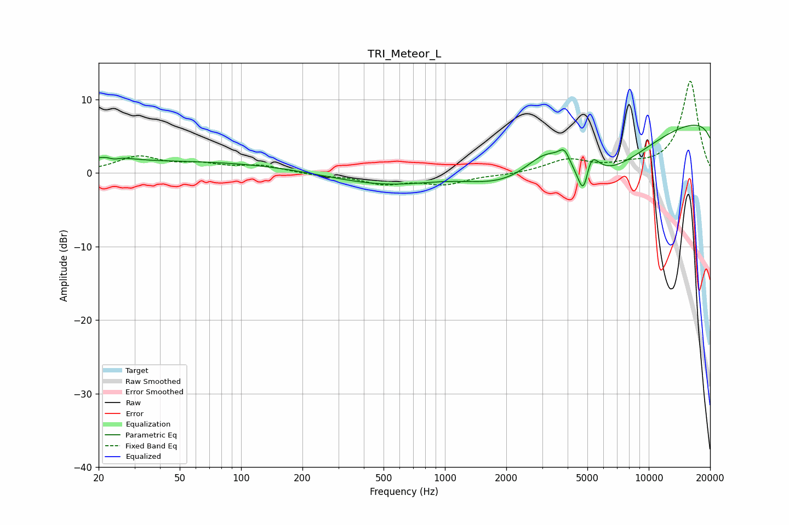

# TRI_Meteor_L
See [usage instructions](https://github.com/jaakkopasanen/AutoEq#usage) for more options and info.

### Parametric EQs
Apply preamp of -6.6 dB when using parametric equalizer.

|   # | Type    |   Fc (Hz) |    Q |   Gain (dB) |
|-----|---------|-----------|------|-------------|
|   1 | Peaking |        23 | 2.16 |         1.1 |
|   2 | Peaking |        24 | 4.56 |        -0.7 |
|   3 | Peaking |        45 | 0.18 |         1.6 |
|   4 | Peaking |      1120 | 0.52 |         5.1 |
|   5 | Peaking |      3195 | 1.02 |         7.6 |
|   6 | Peaking |      3854 | 5.21 |         1.8 |
|   7 | Peaking |      4455 | 0.19 |       -20   |
|   8 | Peaking |      4814 | 4.66 |        -6.2 |
|   9 | Peaking |      5116 | 3.6  |         5.2 |
|  10 | Peaking |     10000 | 0.19 |        18.3 |

### Fixed Band EQs
When using fixed band (also called graphic) equalizer, apply preamp of **-12.6 dB** (if available) and set gains manually with these parameters.

|   # | Type    |   Fc (Hz) |    Q |   Gain (dB) |
|-----|---------|-----------|------|-------------|
|   1 | Peaking |        31 | 1.41 |         2.1 |
|   2 | Peaking |        62 | 1.41 |         1   |
|   3 | Peaking |       125 | 1.41 |         0.9 |
|   4 | Peaking |       250 | 1.41 |        -0.3 |
|   5 | Peaking |       500 | 1.41 |        -1.4 |
|   6 | Peaking |      1000 | 1.41 |        -1.4 |
|   7 | Peaking |      2000 | 1.41 |        -0.2 |
|   8 | Peaking |      4000 | 1.41 |         1.7 |
|   9 | Peaking |      8000 | 1.41 |         0.8 |
|  10 | Peaking |     16000 | 1.41 |        12.5 |

### Graphs

