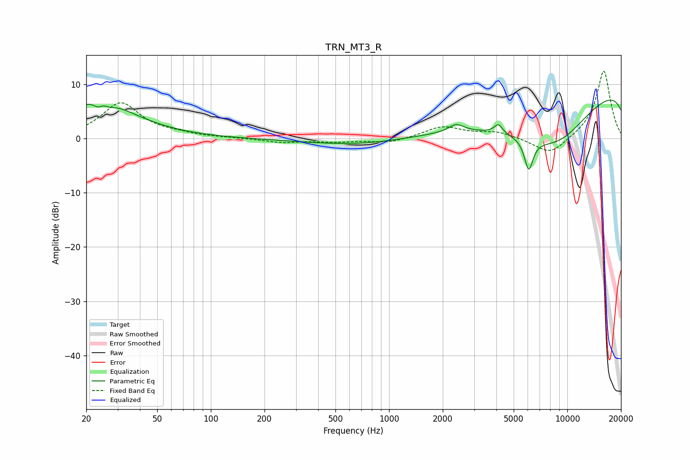

# TRN_MT3_R
See [usage instructions](https://github.com/jaakkopasanen/AutoEq#usage) for more options and info.

### Parametric EQs
Apply preamp of -7.2 dB when using parametric equalizer.

|   # | Type    |   Fc (Hz) |    Q |   Gain (dB) |
|-----|---------|-----------|------|-------------|
|   1 | Peaking |        23 | 4.89 |        -1.7 |
|   2 | Peaking |        23 | 0.68 |         6.4 |
|   3 | Peaking |        24 | 2.54 |         1.7 |
|   4 | Peaking |        27 | 4.04 |        -1.1 |
|   5 | Peaking |      2382 | 3.29 |         1.5 |
|   6 | Peaking |      2455 | 0.19 |        -3.6 |
|   7 | Peaking |      4105 | 6    |         1.7 |
|   8 | Peaking |      6074 | 5.62 |        -5.7 |
|   9 | Peaking |      8696 | 0.4  |       -15.5 |
|  10 | Peaking |     10000 | 0.18 |        17.7 |

### Fixed Band EQs
When using fixed band (also called graphic) equalizer, apply preamp of **-12.5 dB** (if available) and set gains manually with these parameters.

|   # | Type    |   Fc (Hz) |    Q |   Gain (dB) |
|-----|---------|-----------|------|-------------|
|   1 | Peaking |        31 | 1.41 |         6.5 |
|   2 | Peaking |        62 | 1.41 |         0.5 |
|   3 | Peaking |       125 | 1.41 |         0.1 |
|   4 | Peaking |       250 | 1.41 |        -0.7 |
|   5 | Peaking |       500 | 1.41 |        -0.6 |
|   6 | Peaking |      1000 | 1.41 |        -0.8 |
|   7 | Peaking |      2000 | 1.41 |         2.2 |
|   8 | Peaking |      4000 | 1.41 |         1.1 |
|   9 | Peaking |      8000 | 1.41 |        -3.2 |
|  10 | Peaking |     16000 | 1.41 |        12.6 |

### Graphs

