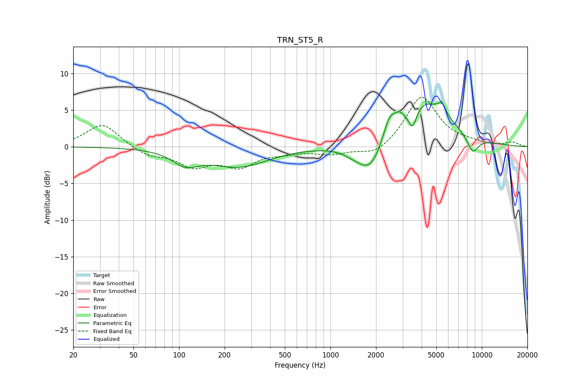

# TRN_ST5_R
See [usage instructions](https://github.com/jaakkopasanen/AutoEq#usage) for more options and info.

### Parametric EQs
Apply preamp of -6.1 dB when using parametric equalizer.

|   # | Type    |   Fc (Hz) |    Q |   Gain (dB) |
|-----|---------|-----------|------|-------------|
|   1 | Peaking |       110 | 1.65 |        -1.9 |
|   2 | Peaking |       249 | 0.73 |        -2.6 |
|   3 | Peaking |      1426 | 1.95 |        -0.8 |
|   4 | Peaking |      1844 | 1.77 |        -4.1 |
|   5 | Peaking |      2460 | 3.57 |         2.7 |
|   6 | Peaking |      2850 | 5.77 |         0.9 |
|   7 | Peaking |      3489 | 5.31 |        -2.8 |
|   8 | Peaking |      4108 | 0.84 |         6.3 |
|   9 | Peaking |      5455 | 5.39 |         1.4 |
|  10 | Peaking |      8710 | 3.39 |        -2.3 |

### Fixed Band EQs
When using fixed band (also called graphic) equalizer, apply preamp of **-6.8 dB** (if available) and set gains manually with these parameters.

|   # | Type    |   Fc (Hz) |    Q |   Gain (dB) |
|-----|---------|-----------|------|-------------|
|   1 | Peaking |        31 | 1.41 |         3.2 |
|   2 | Peaking |        62 | 1.41 |        -1.2 |
|   3 | Peaking |       125 | 1.41 |        -2.4 |
|   4 | Peaking |       250 | 1.41 |        -2.4 |
|   5 | Peaking |       500 | 1.41 |        -0.6 |
|   6 | Peaking |      1000 | 1.41 |        -0.9 |
|   7 | Peaking |      2000 | 1.41 |        -1.4 |
|   8 | Peaking |      4000 | 1.41 |         7   |
|   9 | Peaking |      8000 | 1.41 |         0.4 |
|  10 | Peaking |     16000 | 1.41 |         0.6 |

### Graphs

