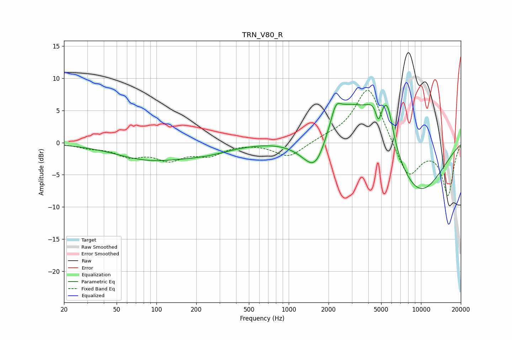

# TRN_V80_R
See [usage instructions](https://github.com/jaakkopasanen/AutoEq#usage) for more options and info.

### Parametric EQs
Apply preamp of -6.2 dB when using parametric equalizer.

|   # | Type    |   Fc (Hz) |    Q |   Gain (dB) |
|-----|---------|-----------|------|-------------|
|   1 | Peaking |        88 | 0.54 |        -2.5 |
|   2 | Peaking |       235 | 0.72 |        -1.2 |
|   3 | Peaking |      1298 | 1.13 |        -1.2 |
|   4 | Peaking |      1603 | 1.58 |        -6   |
|   5 | Peaking |      2272 | 3.96 |         2.5 |
|   6 | Peaking |      2723 | 0.74 |         7.4 |
|   7 | Peaking |      4636 | 1.8  |         5.1 |
|   8 | Peaking |      4767 | 6    |        -3.4 |
|   9 | Peaking |      5596 | 3.16 |         5.2 |
|  10 | Peaking |      9451 | 0.59 |        -8.5 |

### Fixed Band EQs
When using fixed band (also called graphic) equalizer, apply preamp of **-8.2 dB** (if available) and set gains manually with these parameters.

|   # | Type    |   Fc (Hz) |    Q |   Gain (dB) |
|-----|---------|-----------|------|-------------|
|   1 | Peaking |        31 | 1.41 |        -0.6 |
|   2 | Peaking |        62 | 1.41 |        -1.8 |
|   3 | Peaking |       125 | 1.41 |        -2.4 |
|   4 | Peaking |       250 | 1.41 |        -1.7 |
|   5 | Peaking |       500 | 1.41 |         0   |
|   6 | Peaking |      1000 | 1.41 |        -2.3 |
|   7 | Peaking |      2000 | 1.41 |         0.5 |
|   8 | Peaking |      4000 | 1.41 |         9   |
|   9 | Peaking |      8000 | 1.41 |        -5.8 |
|  10 | Peaking |     16000 | 1.41 |        -8.1 |

### Graphs

