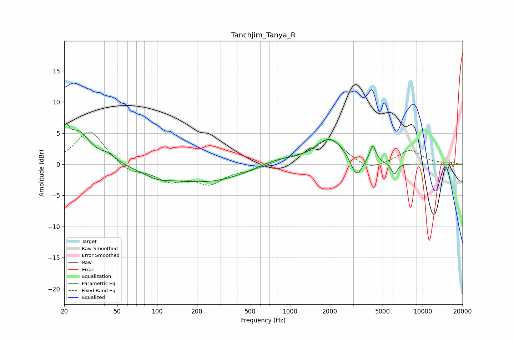

# Tanchjim_Tanya_R
See [usage instructions](https://github.com/jaakkopasanen/AutoEq#usage) for more options and info.

### Parametric EQs
Apply preamp of -6.7 dB when using parametric equalizer.

|   # | Type    |   Fc (Hz) |    Q |   Gain (dB) |
|-----|---------|-----------|------|-------------|
|   1 | Peaking |        20 | 5.87 |         3.3 |
|   2 | Peaking |        25 | 1.63 |         5   |
|   3 | Peaking |        43 | 2.23 |         1.2 |
|   4 | Peaking |       100 | 1.58 |        -0.9 |
|   5 | Peaking |       233 | 0.41 |        -2.9 |
|   6 | Peaking |       778 | 0.87 |         1.3 |
|   7 | Peaking |      2008 | 1.29 |         4.2 |
|   8 | Peaking |      3172 | 3.36 |        -3.2 |
|   9 | Peaking |      4207 | 5.92 |         2.9 |
|  10 | Peaking |      6125 | 6    |        -1.8 |

### Fixed Band EQs
When using fixed band (also called graphic) equalizer, apply preamp of **-5.3 dB** (if available) and set gains manually with these parameters.

|   # | Type    |   Fc (Hz) |    Q |   Gain (dB) |
|-----|---------|-----------|------|-------------|
|   1 | Peaking |        31 | 1.41 |         5.5 |
|   2 | Peaking |        62 | 1.41 |        -1.4 |
|   3 | Peaking |       125 | 1.41 |        -2.4 |
|   4 | Peaking |       250 | 1.41 |        -2.8 |
|   5 | Peaking |       500 | 1.41 |        -0.8 |
|   6 | Peaking |      1000 | 1.41 |         0.8 |
|   7 | Peaking |      2000 | 1.41 |         4   |
|   8 | Peaking |      4000 | 1.41 |        -1.2 |
|   9 | Peaking |      8000 | 1.41 |         2.2 |
|  10 | Peaking |     16000 | 1.41 |         0.2 |

### Graphs

