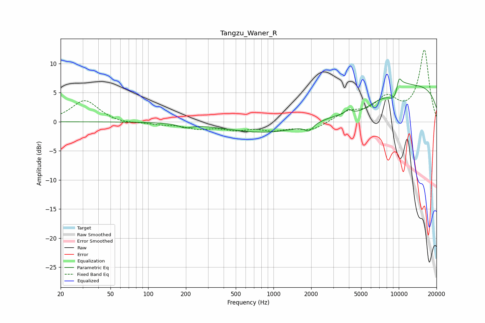

# Tangzu_Waner_R
See [usage instructions](https://github.com/jaakkopasanen/AutoEq#usage) for more options and info.

### Parametric EQs
Apply preamp of -7.5 dB when using parametric equalizer.

|   # | Type    |   Fc (Hz) |    Q |   Gain (dB) |
|-----|---------|-----------|------|-------------|
|   1 | Peaking |       198 | 2.99 |        -0.6 |
|   2 | Peaking |      1916 | 4.39 |        -1.2 |
|   3 | Peaking |      2338 | 0.21 |        -3.4 |
|   4 | Peaking |      3974 | 5.98 |         0.8 |
|   5 | Peaking |      4817 | 1.18 |        -1.4 |
|   6 | Peaking |      9350 | 2.6  |        -3.6 |
|   7 | Peaking |      9779 | 5.93 |        -0.2 |
|   8 | Peaking |     10000 | 0.19 |         7.1 |
|   9 | Peaking |     10000 | 1.74 |         2.5 |
|  10 | Peaking |     10000 | 5.95 |         2.4 |

### Fixed Band EQs
When using fixed band (also called graphic) equalizer, apply preamp of **-12.4 dB** (if available) and set gains manually with these parameters.

|   # | Type    |   Fc (Hz) |    Q |   Gain (dB) |
|-----|---------|-----------|------|-------------|
|   1 | Peaking |        31 | 1.41 |         3.7 |
|   2 | Peaking |        62 | 1.41 |        -0.4 |
|   3 | Peaking |       125 | 1.41 |        -0.4 |
|   4 | Peaking |       250 | 1.41 |        -1   |
|   5 | Peaking |       500 | 1.41 |        -1.1 |
|   6 | Peaking |      1000 | 1.41 |        -1.2 |
|   7 | Peaking |      2000 | 1.41 |        -1.5 |
|   8 | Peaking |      4000 | 1.41 |         1.6 |
|   9 | Peaking |      8000 | 1.41 |         3.7 |
|  10 | Peaking |     16000 | 1.41 |        12.2 |

### Graphs

