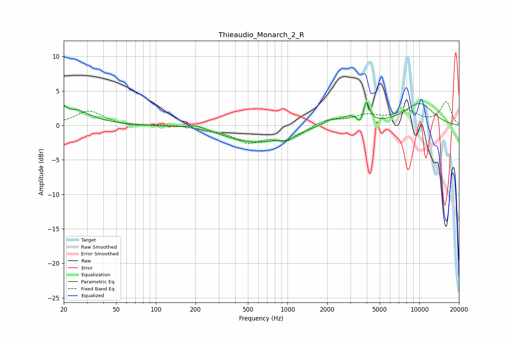

# Thieaudio_Monarch_2_R
See [usage instructions](https://github.com/jaakkopasanen/AutoEq#usage) for more options and info.

### Parametric EQs
Apply preamp of -3.4 dB when using parametric equalizer.

|   # | Type    |   Fc (Hz) |    Q |   Gain (dB) |
|-----|---------|-----------|------|-------------|
|   1 | Peaking |        20 | 1.15 |         3.6 |
|   2 | Peaking |        22 | 3.7  |        -1   |
|   3 | Peaking |       203 | 2.4  |         0.6 |
|   4 | Peaking |       560 | 0.65 |        -2.4 |
|   5 | Peaking |       996 | 2.48 |        -0.8 |
|   6 | Peaking |      2131 | 2.2  |         0.9 |
|   7 | Peaking |      3000 | 2.47 |         1.1 |
|   8 | Peaking |      3588 | 5.67 |        -1.2 |
|   9 | Peaking |      3965 | 6    |         3.1 |
|  10 | Peaking |     10000 | 1.04 |         3.2 |

### Fixed Band EQs
When using fixed band (also called graphic) equalizer, apply preamp of **-3.5 dB** (if available) and set gains manually with these parameters.

|   # | Type    |   Fc (Hz) |    Q |   Gain (dB) |
|-----|---------|-----------|------|-------------|
|   1 | Peaking |        31 | 1.41 |         2.1 |
|   2 | Peaking |        62 | 1.41 |        -0.3 |
|   3 | Peaking |       125 | 1.41 |         0.2 |
|   4 | Peaking |       250 | 1.41 |        -0.4 |
|   5 | Peaking |       500 | 1.41 |        -2.2 |
|   6 | Peaking |      1000 | 1.41 |        -2.1 |
|   7 | Peaking |      2000 | 1.41 |         0.9 |
|   8 | Peaking |      4000 | 1.41 |         1.3 |
|   9 | Peaking |      8000 | 1.41 |         1.9 |
|  10 | Peaking |     16000 | 1.41 |         3.3 |

### Graphs

