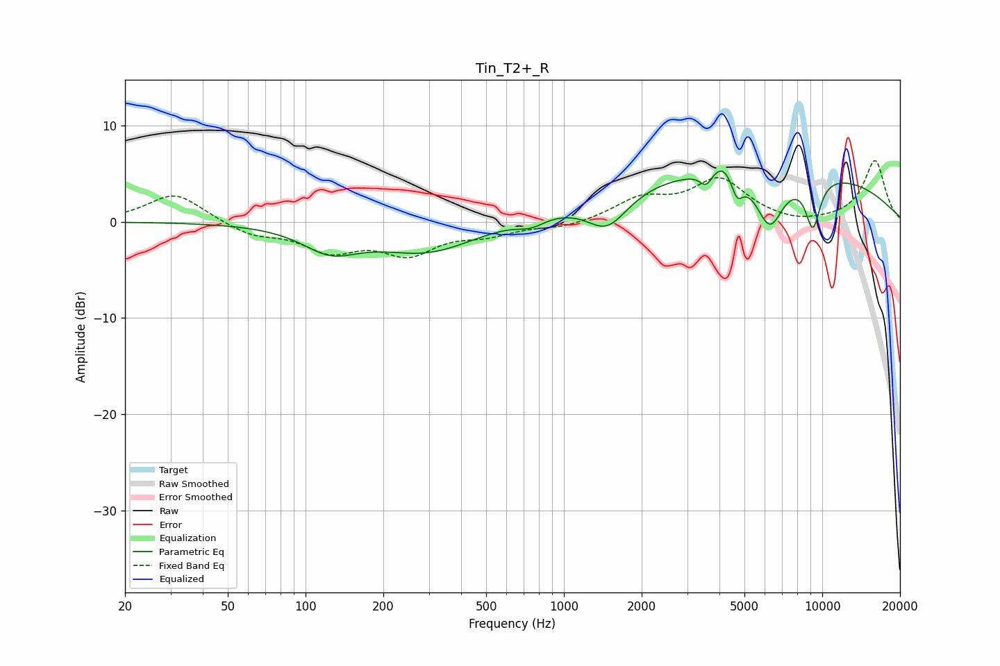

# Tin_T2+_R
See [usage instructions](https://github.com/jaakkopasanen/AutoEq#usage) for more options and info.

### Parametric EQs
Apply preamp of -5.4 dB when using parametric equalizer.

|   # | Type    |   Fc (Hz) |    Q |   Gain (dB) |
|-----|---------|-----------|------|-------------|
|   1 | Peaking |       125 | 1.31 |        -2.5 |
|   2 | Peaking |       297 | 0.73 |        -3.1 |
|   3 | Peaking |       745 | 2.61 |        -0.9 |
|   4 | Peaking |      1471 | 1.73 |        -3.7 |
|   5 | Peaking |      3554 | 6    |        -1.4 |
|   6 | Peaking |      4146 | 3.1  |         1.7 |
|   7 | Peaking |      4678 | 6    |        -2.3 |
|   8 | Peaking |      5582 | 0.2  |         5.7 |
|   9 | Peaking |      6265 | 2.52 |        -5.6 |
|  10 | Peaking |      9198 | 4.38 |        -5.1 |

### Fixed Band EQs
When using fixed band (also called graphic) equalizer, apply preamp of **-6.5 dB** (if available) and set gains manually with these parameters.

|   # | Type    |   Fc (Hz) |    Q |   Gain (dB) |
|-----|---------|-----------|------|-------------|
|   1 | Peaking |        31 | 1.41 |         3   |
|   2 | Peaking |        62 | 1.41 |        -1.3 |
|   3 | Peaking |       125 | 1.41 |        -2.7 |
|   4 | Peaking |       250 | 1.41 |        -3   |
|   5 | Peaking |       500 | 1.41 |        -1.1 |
|   6 | Peaking |      1000 | 1.41 |        -0.6 |
|   7 | Peaking |      2000 | 1.41 |         2.2 |
|   8 | Peaking |      4000 | 1.41 |         4.2 |
|   9 | Peaking |      8000 | 1.41 |        -0.4 |
|  10 | Peaking |     16000 | 1.41 |         6.4 |

### Graphs

