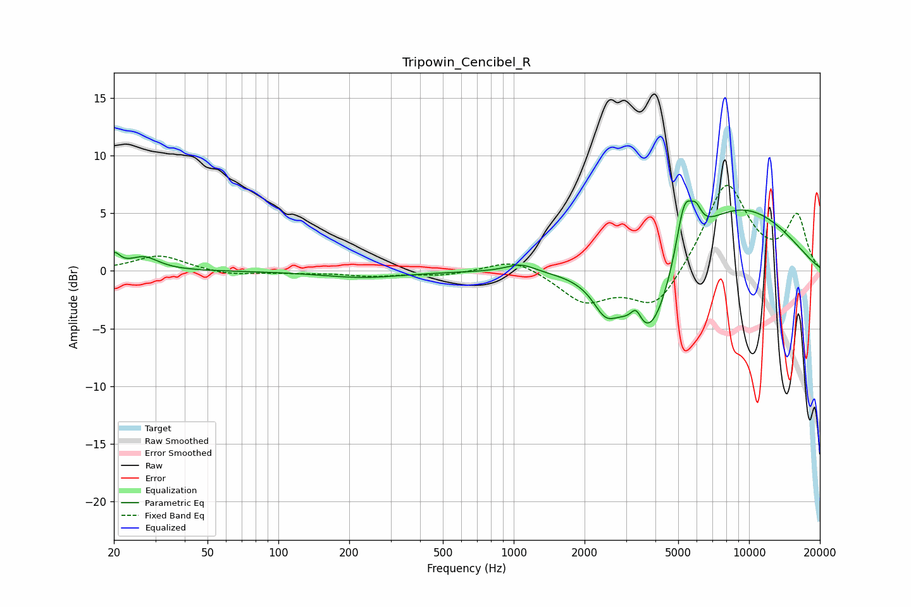

# Tripowin_Cencibel_R
See [usage instructions](https://github.com/jaakkopasanen/AutoEq#usage) for more options and info.

### Parametric EQs
Apply preamp of -6.2 dB when using parametric equalizer.

|   # | Type    |   Fc (Hz) |    Q |   Gain (dB) |
|-----|---------|-----------|------|-------------|
|   1 | Peaking |        20 | 5.91 |         1.2 |
|   2 | Peaking |        27 | 2.29 |         1.2 |
|   3 | Peaking |       229 | 0.8  |        -0.6 |
|   4 | Peaking |      1071 | 2.28 |         0.7 |
|   5 | Peaking |      2448 | 2.71 |        -2.3 |
|   6 | Peaking |      3310 | 6    |         1.6 |
|   7 | Peaking |      3764 | 1.25 |        -8.5 |
|   8 | Peaking |      5309 | 3.85 |         4.9 |
|   9 | Peaking |      5958 | 5.97 |         1.4 |
|  10 | Peaking |      8386 | 0.44 |         6.1 |

### Fixed Band EQs
When using fixed band (also called graphic) equalizer, apply preamp of **-7.5 dB** (if available) and set gains manually with these parameters.

|   # | Type    |   Fc (Hz) |    Q |   Gain (dB) |
|-----|---------|-----------|------|-------------|
|   1 | Peaking |        31 | 1.41 |         1.4 |
|   2 | Peaking |        62 | 1.41 |        -0.4 |
|   3 | Peaking |       125 | 1.41 |        -0.1 |
|   4 | Peaking |       250 | 1.41 |        -0.4 |
|   5 | Peaking |       500 | 1.41 |        -0.4 |
|   6 | Peaking |      1000 | 1.41 |         1.2 |
|   7 | Peaking |      2000 | 1.41 |        -2.6 |
|   8 | Peaking |      4000 | 1.41 |        -3.4 |
|   9 | Peaking |      8000 | 1.41 |         7.7 |
|  10 | Peaking |     16000 | 1.41 |         4.6 |

### Graphs

