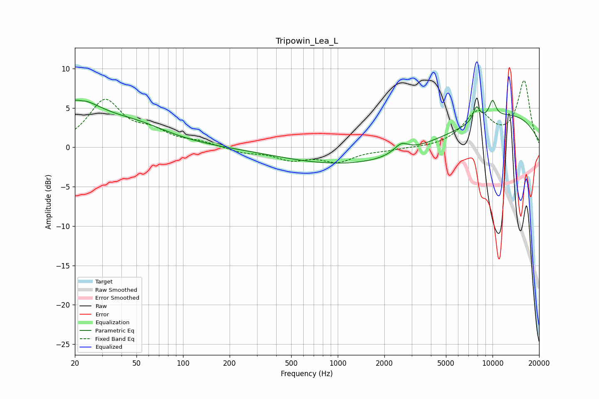

# Tripowin_Lea_L
See [usage instructions](https://github.com/jaakkopasanen/AutoEq#usage) for more options and info.

### Parametric EQs
Apply preamp of -6.1 dB when using parametric equalizer.

|   # | Type    |   Fc (Hz) |    Q |   Gain (dB) |
|-----|---------|-----------|------|-------------|
|   1 | Peaking |        20 | 0.81 |         5.3 |
|   2 | Peaking |        23 | 5.92 |        -3   |
|   3 | Peaking |        23 | 5.94 |         2.9 |
|   4 | Peaking |        51 | 0.65 |         2.1 |
|   5 | Peaking |      2209 | 0.2  |        -2.8 |
|   6 | Peaking |      2499 | 2.03 |         0.1 |
|   7 | Peaking |      2574 | 3.09 |         1.2 |
|   8 | Peaking |      7869 | 5.85 |         1.9 |
|   9 | Peaking |     10000 | 0.29 |         5.1 |
|  10 | Peaking |     10000 | 5.65 |         2.1 |

### Fixed Band EQs
When using fixed band (also called graphic) equalizer, apply preamp of **-8.5 dB** (if available) and set gains manually with these parameters.

|   # | Type    |   Fc (Hz) |    Q |   Gain (dB) |
|-----|---------|-----------|------|-------------|
|   1 | Peaking |        31 | 1.41 |         5.8 |
|   2 | Peaking |        62 | 1.41 |         1.6 |
|   3 | Peaking |       125 | 1.41 |         0.6 |
|   4 | Peaking |       250 | 1.41 |        -0.6 |
|   5 | Peaking |       500 | 1.41 |        -1.4 |
|   6 | Peaking |      1000 | 1.41 |        -1.7 |
|   7 | Peaking |      2000 | 1.41 |        -0.3 |
|   8 | Peaking |      4000 | 1.41 |        -0.1 |
|   9 | Peaking |      8000 | 1.41 |         4.2 |
|  10 | Peaking |     16000 | 1.41 |         8.3 |

### Graphs

