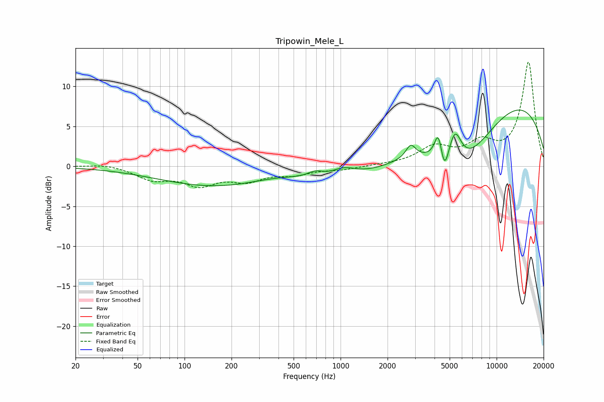

# Tripowin_Mele_L
See [usage instructions](https://github.com/jaakkopasanen/AutoEq#usage) for more options and info.

### Parametric EQs
Apply preamp of -7.1 dB when using parametric equalizer.

|   # | Type    |   Fc (Hz) |    Q |   Gain (dB) |
|-----|---------|-----------|------|-------------|
|   1 | Peaking |       388 | 0.18 |        -3.5 |
|   2 | Peaking |       416 | 0.61 |         1.8 |
|   3 | Peaking |       688 | 2.84 |         0.8 |
|   4 | Peaking |      1047 | 1.74 |         1.2 |
|   5 | Peaking |      2818 | 4.45 |         1.7 |
|   6 | Peaking |      4224 | 6    |         3.1 |
|   7 | Peaking |      4637 | 5.63 |        -2.8 |
|   8 | Peaking |      5415 | 3.47 |         3.8 |
|   9 | Peaking |      6177 | 0.64 |        -7.6 |
|  10 | Peaking |      9942 | 0.25 |         9.7 |

### Fixed Band EQs
When using fixed band (also called graphic) equalizer, apply preamp of **-13.1 dB** (if available) and set gains manually with these parameters.

|   # | Type    |   Fc (Hz) |    Q |   Gain (dB) |
|-----|---------|-----------|------|-------------|
|   1 | Peaking |        31 | 1.41 |         0.3 |
|   2 | Peaking |        62 | 1.41 |        -1.5 |
|   3 | Peaking |       125 | 1.41 |        -2.1 |
|   4 | Peaking |       250 | 1.41 |        -1.5 |
|   5 | Peaking |       500 | 1.41 |        -0.9 |
|   6 | Peaking |      1000 | 1.41 |        -0.4 |
|   7 | Peaking |      2000 | 1.41 |         0.1 |
|   8 | Peaking |      4000 | 1.41 |         2.2 |
|   9 | Peaking |      8000 | 1.41 |         2.5 |
|  10 | Peaking |     16000 | 1.41 |        13   |

### Graphs

