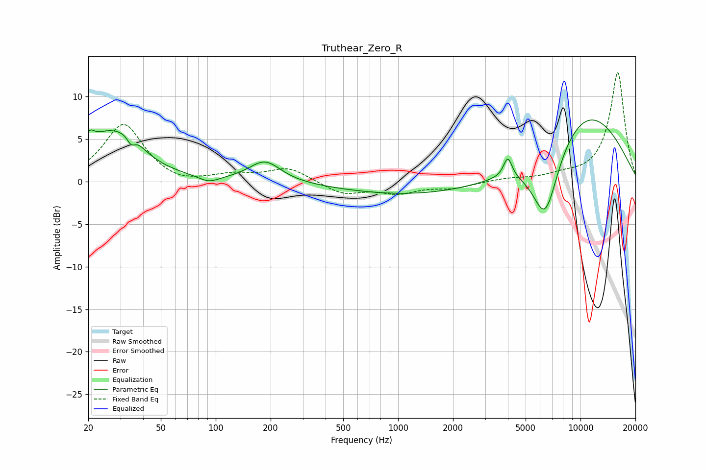

# Truthear_Zero_R
See [usage instructions](https://github.com/jaakkopasanen/AutoEq#usage) for more options and info.

### Parametric EQs
Apply preamp of -7.4 dB when using parametric equalizer.

|   # | Type    |   Fc (Hz) |    Q |   Gain (dB) |
|-----|---------|-----------|------|-------------|
|   1 | Peaking |        20 | 5.4  |         1.5 |
|   2 | Peaking |        26 | 0.94 |         5.6 |
|   3 | Peaking |        34 | 5.68 |        -1.6 |
|   4 | Peaking |        35 | 2.87 |         1.6 |
|   5 | Peaking |        92 | 2.48 |        -0.8 |
|   6 | Peaking |       186 | 1.63 |         2.5 |
|   7 | Peaking |      2386 | 0.2  |        -2   |
|   8 | Peaking |      3995 | 6    |         2.4 |
|   9 | Peaking |      6404 | 1.78 |        -8.9 |
|  10 | Peaking |     10000 | 0.43 |         9.4 |

### Fixed Band EQs
When using fixed band (also called graphic) equalizer, apply preamp of **-12.9 dB** (if available) and set gains manually with these parameters.

|   # | Type    |   Fc (Hz) |    Q |   Gain (dB) |
|-----|---------|-----------|------|-------------|
|   1 | Peaking |        31 | 1.41 |         6.8 |
|   2 | Peaking |        62 | 1.41 |        -0.6 |
|   3 | Peaking |       125 | 1.41 |         0.7 |
|   4 | Peaking |       250 | 1.41 |         1.6 |
|   5 | Peaking |       500 | 1.41 |        -1.4 |
|   6 | Peaking |      1000 | 1.41 |        -1.2 |
|   7 | Peaking |      2000 | 1.41 |        -0.7 |
|   8 | Peaking |      4000 | 1.41 |         0.3 |
|   9 | Peaking |      8000 | 1.41 |         0.6 |
|  10 | Peaking |     16000 | 1.41 |        12.9 |

### Graphs

