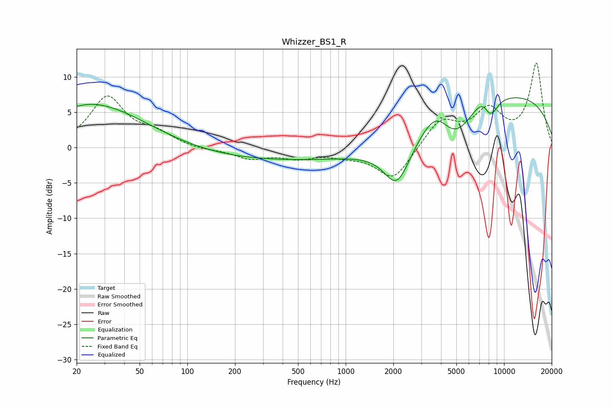

# Whizzer_BS1_R
See [usage instructions](https://github.com/jaakkopasanen/AutoEq#usage) for more options and info.

### Parametric EQs
Apply preamp of -7.1 dB when using parametric equalizer.

|   # | Type    |   Fc (Hz) |    Q |   Gain (dB) |
|-----|---------|-----------|------|-------------|
|   1 | Peaking |        20 | 3.9  |        -0.2 |
|   2 | Peaking |        24 | 0.41 |         6.3 |
|   3 | Peaking |       508 | 0.18 |        -1.9 |
|   4 | Peaking |      2113 | 1.66 |        -6.2 |
|   5 | Peaking |      3800 | 1.39 |         5.2 |
|   6 | Peaking |      4711 | 1.06 |        -6.3 |
|   7 | Peaking |      7440 | 1.74 |         2.2 |
|   8 | Peaking |      8334 | 3.79 |        -4.1 |
|   9 | Peaking |      8397 | 5.94 |         1.4 |
|  10 | Peaking |      9948 | 0.23 |         7.6 |

### Fixed Band EQs
When using fixed band (also called graphic) equalizer, apply preamp of **-12.0 dB** (if available) and set gains manually with these parameters.

|   # | Type    |   Fc (Hz) |    Q |   Gain (dB) |
|-----|---------|-----------|------|-------------|
|   1 | Peaking |        31 | 1.41 |         7   |
|   2 | Peaking |        62 | 1.41 |         1.7 |
|   3 | Peaking |       125 | 1.41 |        -0.3 |
|   4 | Peaking |       250 | 1.41 |        -1.5 |
|   5 | Peaking |       500 | 1.41 |        -1.3 |
|   6 | Peaking |      1000 | 1.41 |        -0.8 |
|   7 | Peaking |      2000 | 1.41 |        -4.6 |
|   8 | Peaking |      4000 | 1.41 |         3.9 |
|   9 | Peaking |      8000 | 1.41 |         4.8 |
|  10 | Peaking |     16000 | 1.41 |        11.8 |

### Graphs

