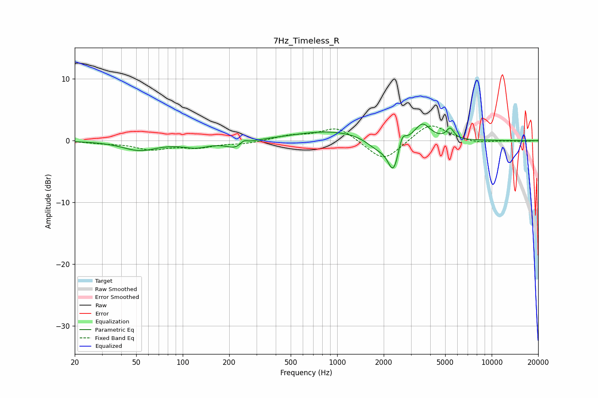

# 7Hz_Timeless_R
See [usage instructions](https://github.com/jaakkopasanen/AutoEq#usage) for more options and info.

### Parametric EQs
Apply preamp of -2.8 dB when using parametric equalizer.

|   # | Type    |   Fc (Hz) |    Q |   Gain (dB) |
|-----|---------|-----------|------|-------------|
|   1 | Peaking |        53 | 1.28 |        -1.5 |
|   2 | Peaking |       122 | 1.64 |        -1   |
|   3 | Peaking |       221 | 2.37 |        -1.2 |
|   4 | Peaking |       248 | 6    |         0.7 |
|   5 | Peaking |       919 | 0.58 |         1.6 |
|   6 | Peaking |      1812 | 1.98 |        -1.6 |
|   7 | Peaking |      2313 | 3.87 |        -5.2 |
|   8 | Peaking |      2631 | 6    |         2.2 |
|   9 | Peaking |      3557 | 2.77 |         2.8 |
|  10 | Peaking |      5387 | 5.99 |         1.7 |

### Fixed Band EQs
When using fixed band (also called graphic) equalizer, apply preamp of **-2.5 dB** (if available) and set gains manually with these parameters.

|   # | Type    |   Fc (Hz) |    Q |   Gain (dB) |
|-----|---------|-----------|------|-------------|
|   1 | Peaking |        31 | 1.41 |        -0.3 |
|   2 | Peaking |        62 | 1.41 |        -1.3 |
|   3 | Peaking |       125 | 1.41 |        -1   |
|   4 | Peaking |       250 | 1.41 |        -0.4 |
|   5 | Peaking |       500 | 1.41 |         0.8 |
|   6 | Peaking |      1000 | 1.41 |         2.3 |
|   7 | Peaking |      2000 | 1.41 |        -3.5 |
|   8 | Peaking |      4000 | 1.41 |         2.9 |
|   9 | Peaking |      8000 | 1.41 |        -0.5 |
|  10 | Peaking |     16000 | 1.41 |        -0.1 |

### Graphs

