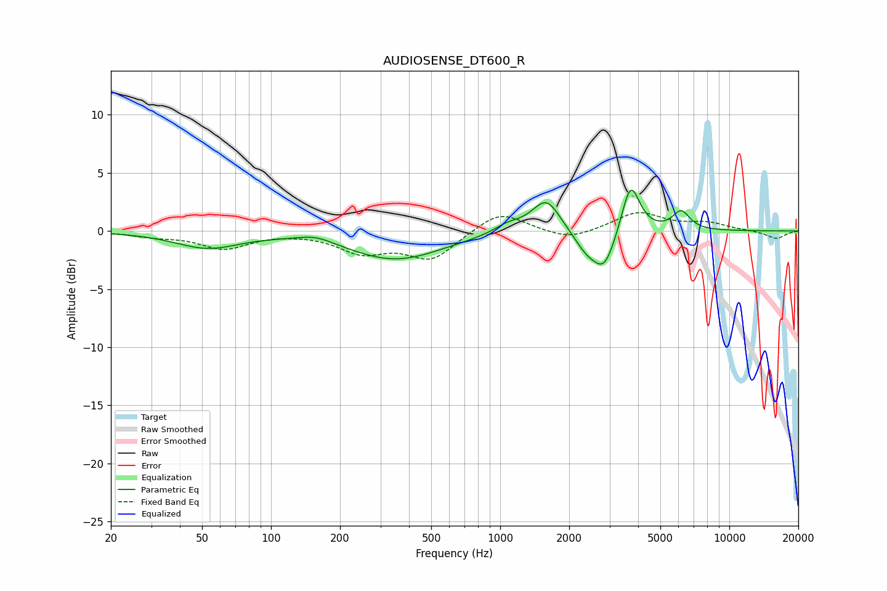

# AUDIOSENSE_DT600_R
See [usage instructions](https://github.com/jaakkopasanen/AutoEq#usage) for more options and info.

### Parametric EQs
Apply preamp of -3.6 dB when using parametric equalizer.

|   # | Type    |   Fc (Hz) |    Q |   Gain (dB) |
|-----|---------|-----------|------|-------------|
|   1 | Peaking |        53 | 1    |        -1.4 |
|   2 | Peaking |       157 | 1.85 |         0.6 |
|   3 | Peaking |       349 | 0.69 |        -2.5 |
|   4 | Peaking |      1081 | 2.26 |         0.7 |
|   5 | Peaking |      1591 | 2.25 |         2.9 |
|   6 | Peaking |      2360 | 2.1  |        -1   |
|   7 | Peaking |      2382 | 3.19 |        -0.5 |
|   8 | Peaking |      2849 | 2.82 |        -3.1 |
|   9 | Peaking |      3707 | 3.57 |         4.4 |
|  10 | Peaking |      6164 | 3.68 |         1.6 |

### Fixed Band EQs
When using fixed band (also called graphic) equalizer, apply preamp of **-1.7 dB** (if available) and set gains manually with these parameters.

|   # | Type    |   Fc (Hz) |    Q |   Gain (dB) |
|-----|---------|-----------|------|-------------|
|   1 | Peaking |        31 | 1.41 |        -0.4 |
|   2 | Peaking |        62 | 1.41 |        -1.4 |
|   3 | Peaking |       125 | 1.41 |        -0   |
|   4 | Peaking |       250 | 1.41 |        -1.7 |
|   5 | Peaking |       500 | 1.41 |        -2.4 |
|   6 | Peaking |      1000 | 1.41 |         1.8 |
|   7 | Peaking |      2000 | 1.41 |        -0.8 |
|   8 | Peaking |      4000 | 1.41 |         1.6 |
|   9 | Peaking |      8000 | 1.41 |         0.6 |
|  10 | Peaking |     16000 | 1.41 |        -0.7 |

### Graphs

