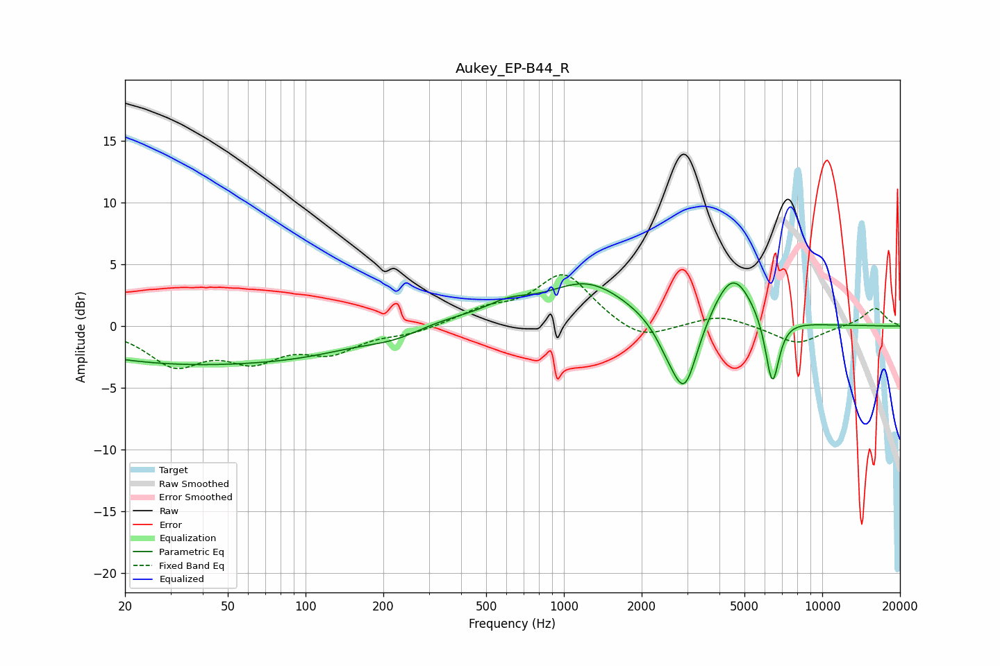

# Aukey_EP-B44_R
See [usage instructions](https://github.com/jaakkopasanen/AutoEq#usage) for more options and info.

### Parametric EQs
Apply preamp of -3.6 dB when using parametric equalizer.

|   # | Type    |   Fc (Hz) |    Q |   Gain (dB) |
|-----|---------|-----------|------|-------------|
|   1 | Peaking |        33 | 0.3  |        -2.9 |
|   2 | Peaking |       109 | 0.63 |        -0.9 |
|   3 | Peaking |       230 | 1.03 |        -1.6 |
|   4 | Peaking |       273 | 0.73 |         1.4 |
|   5 | Peaking |       610 | 1.6  |         1   |
|   6 | Peaking |      1234 | 0.88 |         3.4 |
|   7 | Peaking |      2530 | 2.56 |        -1.5 |
|   8 | Peaking |      2936 | 2.78 |        -5.7 |
|   9 | Peaking |      4501 | 1.77 |         4.4 |
|  10 | Peaking |      6408 | 5.11 |        -5.7 |

### Fixed Band EQs
When using fixed band (also called graphic) equalizer, apply preamp of **-4.2 dB** (if available) and set gains manually with these parameters.

|   # | Type    |   Fc (Hz) |    Q |   Gain (dB) |
|-----|---------|-----------|------|-------------|
|   1 | Peaking |        31 | 1.41 |        -2.9 |
|   2 | Peaking |        62 | 1.41 |        -2.4 |
|   3 | Peaking |       125 | 1.41 |        -1.9 |
|   4 | Peaking |       250 | 1.41 |        -0.5 |
|   5 | Peaking |       500 | 1.41 |         1.1 |
|   6 | Peaking |      1000 | 1.41 |         4.2 |
|   7 | Peaking |      2000 | 1.41 |        -1.4 |
|   8 | Peaking |      4000 | 1.41 |         0.9 |
|   9 | Peaking |      8000 | 1.41 |        -1.5 |
|  10 | Peaking |     16000 | 1.41 |         1.5 |

### Graphs

